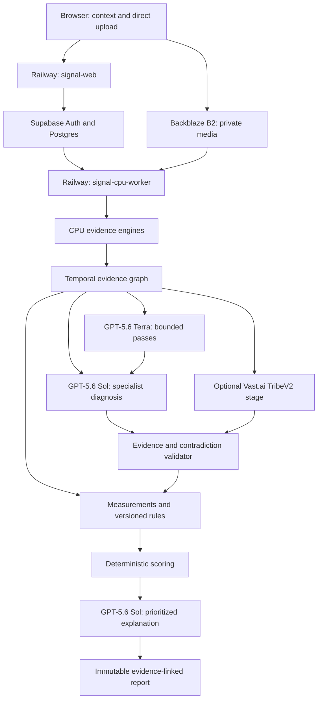

# Sakhaa Signal — Consolidated Final Revamp Plan

**Status:** Final implementation source of truth  
**Date:** 3 August 2026  
**Repository baseline audited:** `main` at `b94d6ae40cd67e374190b80c708a19a6433b784d`  
**Delivery approach:** Approach A — Evidence-first vertical slices  
**Primary objective:** Produce a truthful, evidence-complete PPC video creative diagnosis without Google Video Intelligence, without a Google Cloud billing account/card, and without GPU usage in Standard mode.  
**Primary semantic intelligence:** GPT-5.6 Sol, supported by GPT-5.6 Terra for bounded lower-cost work.  
**Optional GPU scope:** TribeV2 only, in explicitly selected Full mode.

---

## 0. Consolidation statement

Yes: all results from the previous audit, the CPU-first Google Video Intelligence replacement answer, the complete technology/deployment map, and the OpenAI-brain revamp are part of this final plan.

This document supersedes the shorter revamp plan. It preserves and expands the approved design rather than replacing it with a competing architecture. In particular, it incorporates:

1. The audited proof that the current Video Standard path can fabricate evidence and award a black, silent video an `89/100` score.
2. Every P0/P1 weakness identified in upload, preprocessing, OCR/CV, audio, GPT synthesis, scoring, job orchestration, TribeV2 and reporting.
3. The complete no-card Google Video Intelligence replacement stack.
4. The three-level whole-video processing method: every-frame scan, triggered CPU inference and adaptive multimodal evidence.
5. The complete PPC measurement catalogue: hook, message, brand, product, offer, CTA, trust, narrative, audio, visual craft, native fit, platform fit, compliance, context and data quality.
6. The full Railway/Supabase/B2/OpenAI/Vast deployment and technology map.
7. GPT-5.6 Terra/Sol model routing, structured outputs, specialist analysis and evidence validation.
8. Deterministic, objective- and placement-specific scoring.
9. Evidence-linked reports, partial/failure states, leases, retries, retention, security, observability, golden tests and outcome calibration.

No part of the Google-free replacement is optional merely because it uses several small engines instead of one cloud API. Together, those engines are the Video Standard evidence layer.

---

## 1. Executive decision

Sakhaa Signal will use a CPU-first, evidence-complete hybrid architecture:

1. Local CPU engines inspect the complete media timeline and produce measurable, timestamped evidence.
2. GPT-5.6 Terra performs bounded, repeatable semantic classification and 10–15-second segment compression.
3. GPT-5.6 Sol acts as the major reasoning brain for cross-modal PPC diagnosis, visual hierarchy, narrative meaning, root-cause analysis and prioritized improvement suggestions.
4. A deterministic validator rejects every semantic claim that lacks valid evidence.
5. A versioned deterministic rule and scoring engine calculates all numeric scores.
6. TribeV2 remains a separate, optional Full-mode signal. It never substitutes for Standard PPC analysis.

### Final deployment shape

```text
Customer browser
    → Railway signal-web
        → Supabase Auth/Postgres
        → private Backblaze B2 presigned upload
    → Railway signal-cpu-worker
        → local open-source CPU evidence engines
        → OpenAI Responses API
        → deterministic validation, rules and scoring
        → immutable evidence-linked report
    → optional Vast.ai TribeV2 worker for Full mode only
```

### Non-negotiable product truth

Sakhaa Signal can become 100% timeline-covered, evidence-traceable and non-fabricating. It cannot be 100% certain that a creative will achieve a particular CTR, CVR, CPA or ROAS from media content alone. Actual results also depend on audience, bid strategy, placement, competition, budget, landing page, offer, seasonality, attribution and campaign history.

Until real campaign labels are integrated, the user-facing result is a **PPC Creative Diagnostic Score** or **Creative Readiness Score**, not a predicted performance score.

### 1.1 Architecture options evaluated

| Approach | Measurable coverage | Semantic accuracy | CPU viability | Final verdict |
|---|---:|---:|---:|---|
| Fixed frames plus one GPT call | Poor | Unreliable | Excellent | Reject |
| Send a frame every second | Moderate | Inconsistent and event-blind between samples | Good | Reject as the primary method |
| Send the entire video to one cloud provider | Potentially high | Provider-dependent | API-dependent | Reject for the no-GVI/no-card constraint |
| Fully local CPU models only | High for measurable signals | Weak for nuanced creative meaning | Possible but slower | Use as the evidence foundation, not the whole product |
| CPU timeline analysis plus adaptive GPT evidence | High | Strong | Strong | Recommended |
| Multiple specialist GPT passes over validated evidence | High | Stronger and more auditable | Strong | Recommended production semantic design |
| TribeV2 for every video | Separate neuro-model signal | Not a PPC-analysis substitute | Requires GPU | Full mode only |

The selected design is not “one smarter model.” It is a collection of evidence-producing CPU stages followed by constrained semantic evaluation.

---

## 2. Current-state audit and release blockers

### 2.1 Proof that the current path is unsafe

The current pipeline was executed against a 15-second completely black, silent video.

| Actual input | Current output |
|---|---|
| No audio | Invented speech beginning at 200 ms |
| No text | Invented `STOP SCROLLING – NEW ARRIVAL 50% OFF` |
| No logo | Invented two logo appearances |
| No edits | Invented four shots |
| Completely blank creative | **89/100 — TOP_PERFORMER** |
| Hook score | **98/100** |
| Brand score | **95/100** |
| Audio score | **90/100** |

This is a release blocker. No production report is trustworthy until the fail-open paths below are removed.

### 2.2 P0 fabrication paths

| Current component | Unsafe behaviour | Required replacement |
|---|---|---|
| `packages/engines/src/cv/google-video-intelligence.ts` | Empty/unavailable Google results become fixed sample text, shots and logos | Remove from Video Standard; use real local engines and valid empty results |
| `packages/engines/src/audio/groq-whisper.ts` | Provider failure becomes a fixed transcript | Replace with local `whisper.cpp`; failure remains visible |
| `packages/engines/src/audio/yamnet-classifier.ts` | Invents speech/music/silence ratios and labels RMS logic as YAMNet | Replace with real YAMNet; retain separate RMS/loudness measurements under honest labels |
| `packages/engines/src/openai/video-synthesis.ts` | GPT failure becomes fixed findings about voiceover, logo and “next generation solution” | Return a typed model-stage failure; never substitute semantic content |
| `apps/web/src/app/analysis/[jobId]/video-report.tsx` | Shows demo scores, transcript, OCR and recommendations before a real report exists | Poll a protected report API and render processing/partial/failed states |
| `apps/gpu-worker/app/pipeline.py` | Missing input/model failures become text files, random brain predictions and synthetic completion | Real Tribe inference or explicit failure only |

Required semantics:

```text
No audio stream        → NOT_APPLICABLE
Nothing detected       → NOT_DETECTED
Engine not requested   → NOT_REQUESTED
Engine unavailable     → UNAVAILABLE or FAILED
Independent failure    → COMPLETED_PARTIAL where policy permits
Mandatory integrity failure → FAILED
Simulator adapter      → TEST/SIMULATED only, never production
```

### 2.3 Incomplete media coverage

The current video inspector extracts seven fixed frames at roughly `0s`, `0.5s`, `1s`, `2s`, `3s`, midpoint and end card. The GPT call then uses `slice(0, 5)`, so GPT sees only the first five opening frames. It cannot inspect most product demonstrations, offers, proof, CTA, end cards or narrative resolution.

The current GPT request also receives only:

- The first 30 transcript words.
- The first 15 seconds of audio events.
- Low-detail images.
- No frame-specific timestamp labels.
- No shot IDs or evidence IDs next to each image.
- No safe-zone overlays.
- No segment-by-segment synthesis.

### 2.4 Invalid scoring

The current visual hook score is effectively:

```ts
numberOfSampledHookFrames * 22
```

Any video that yields the predetermined opening frames can therefore receive a perfect visual hook score even if every frame is black.

Other invalid score behaviours include:

- Copy starts at 85 by default.
- Any OCR text earns points regardless of meaning, contrast or readability.
- Any logo before three seconds automatically earns 95.
- Fast pacing is assumed beneficial and excessive cuts are not penalized.
- CTA, offer, product, trust, hierarchy, compliance and placement fit are not properly scored.
- The same weights apply to every platform, placement and campaign objective.
- Missing evidence does not reduce confidence or availability.
- Video category confidence is hard-coded to `0.9`.
- GPT can return confident recommendations even when the underlying evidence is fabricated or incomplete.

### 2.5 Disconnected Full/TribeV2 path

`FULL_WITH_TRIBEV2` currently creates the same `AnalysisJob` consumed by the CPU worker, but the processing method never branches into a Tribe stage. A second legacy `Job`/API system separately attempts to call the GPU worker. The application therefore has two disconnected job systems.

The fix is one canonical job graph with an optional isolated `TRIBE_INFERENCE` stage.

### 2.6 Other audited gaps

| Gap | Consequence | Required correction |
|---|---|---|
| Google Video Intelligence dependency is missing | Configured production call can fail before fabricated fallback runs | Delete provider path and package |
| Google timestamps ignore protobuf nanoseconds | Subsecond events collapse to wrong times | Use local millisecond timeline; reject out-of-range values |
| OCR bounding boxes are hard-coded | Safe-zone and hierarchy results are invalid | Persist real detector polygons/boxes |
| Only first text/logo tracks are used | Repeated/moving appearances disappear | Build temporal tracks over the full timeline |
| No real `RULE_EVALUATION` execution | Video rules are not actually applied | Implement a versioned rule stage |
| No video `EvidenceObservation` persistence | Findings cannot be audited | Persist evidence before semantic analysis |
| Provider/model/version metadata omitted | Reports cannot be reproduced | Record engine/model/prompt/preprocess versions and hashes |
| Selected OpenAI model ignored | UI choice does not control execution | Use a server-owned stage-to-model registry |
| Stage-name mismatches | Job may succeed while stages remain queued | Generate stage enums/contracts from one source |
| Five-minute lease without heartbeat | Long jobs may be processed twice | Heartbeats, opaque lease tokens and compare-and-set completion |
| Retries are not idempotent | Duplicate findings/scores/reports can be inserted | Unique attempt/output keys and idempotent effects |
| Report page does not poll | User sees a fake completed page while queued | Poll/SSE durable status and stop on terminal state |
| `/api/uploads/view` absent | Video playback is broken | Authorized signed-download/report-media route |
| Direct Prisma report query lacks workspace check | Known UUID may bypass protected path | Authorized report service scoped by workspace |
| Temp input is never cleaned | Worker disk grows without bound | Isolated temp directory and `finally` cleanup |
| No Video Standard tests | Fabrication and black-video failure go unnoticed | Golden fixtures and failure tests |
| Root typecheck expects missing server files | Verification fails before TypeScript checking | Repair root verification contract |
| Large upload passes through `req.arrayBuffer()` | A 500 MB promise cannot work on serverless request limits | Browser-to-B2 presigned upload |

---

## 3. Scope, guarantees and exclusions

### 3.1 V1 scope

- Authenticated single-member workspaces.
- Static Standard analysis.
- Video Standard analysis with no Google Video Intelligence and no GPU.
- Optional Full Video analysis with isolated TribeV2.
- Optional per-analysis brand kit and platform/placement context.
- Durable background jobs, retries, partial completion and cancellation.
- Evidence-linked findings, deterministic rules/scores and raw JSON.
- Thirty-day source/intermediate retention, immediate deletion and incremental Tribe upgrade.

### 3.2 Product boundary

Sakhaa Signal is an independent pre-flight Creative Intelligence product. Forge generation, publishing, viral discovery and blueprint/acquisition workflows are outside this runtime and schema.

### 3.3 What “100% effective” may truthfully mean

The implementation can guarantee:

- 100% of decoded frames pass through the basic change/quality scanner, or the report states a measured coverage gap.
- 100% of detected shots receive representative evidence coverage.
- 100% of the audio duration is processed or explicitly unavailable.
- 100% of material detected OCR changes are tracked.
- 100% of semantic findings cite stored evidence.
- 100% of scores identify measurements, rules, versions and weights.
- Missing engines never produce invented observations.
- Unsupported conclusions are rejected.
- Report confidence falls when coverage or evidence quality falls.
- TribeV2 remains visibly separate from Standard PPC diagnosis.

It cannot guarantee:

- Recognition of every stylized, blurred or multilingual word.
- Identification of every unknown logo or product.
- Correct interpretation of every cultural reference.
- That best-practice compliance produces high ROAS.
- That one creative will outperform another without campaign outcome data.

---

## 4. Governing principles

1. **Evidence before interpretation.** No model sees a free-form prompt containing guessed detections.
2. **Complete timeline coverage.** Cheap measurements scan the whole decoded timeline; expensive analysis is trigger-based.
3. **No fabricated fallbacks.** Valid empty results and explicit failures are normal states.
4. **One canonical clock.** All video evidence uses milliseconds from the validated media timeline.
5. **Geometry is deterministic.** Coordinates, overlap, duration, dwell and safe-zone intersection are computed, not guessed by GPT.
6. **Semantics are evidence-bounded.** Terra and Sol may interpret meaning only from referenced inputs.
7. **Scoring is deterministic.** Models create semantic measurements/findings, never final numbers.
8. **Context changes evaluation.** Platform, placement, objective, funnel stage, country, language and vertical select the rule profile.
9. **Standard and Full are separate instruments.** TribeV2 is an optional model signal, not a substitute for PPC diagnosis.
10. **Every stage is reproducible.** Store source hash, config, model checksum, prompt version, rule version and artifact hash.
11. **Partial is honest.** A useful incomplete report is allowed only when every dependency and limitation is visible.
12. **Accuracy is measured.** Engine/model choices are pinned only after representative, reviewer-labelled evaluation.

---

## 5. Final system architecture



### 5.1 Railway services

| Service | Public | Responsibility |
|---|---:|---|
| `signal-web` | Yes | Next.js UI, Supabase session, workspace authorization, upload authorization/completion, job/report APIs and worker coordination |
| `signal-cpu-worker` | No | Media download, validation, full Standard analysis, OpenAI calls, deterministic rules/scoring and report publication |
| `signal-maintenance` | No | Stale-lease recovery, retention, deletion, orphan reconciliation and cleanup |

Long-running FFmpeg, OCR, transcription, CV or model work must never execute inside a Next.js request handler.

### 5.2 Production versus development

| Environment | Where analysis runs |
|---|---|
| Production Standard | Railway `signal-cpu-worker` |
| Production Full | Railway CPU worker plus Vast.ai TribeV2 GPU worker |
| Local development | The same CPU-worker Docker image on the developer's Windows machine |
| CI/golden tests | Pinned containers with real small fixtures and explicitly labelled test adapters |
| Customer browser | Context, direct upload, progress and report rendering only |

The production system does not consume the customer's CPU for analysis.

---

## 6. Complete application and infrastructure technology map

| Technology | Runtime/location | External API or local? | Exact responsibility | Status |
|---|---|---|---|---|
| Next.js `16.2.9` | Railway `signal-web` | Local app runtime | UI, dashboard, upload flow, protected APIs, status and reports | Keep |
| React `19.2.4` | Browser | Local frontend | Analysis wizard, mode selection, evidence timeline and report components | Keep |
| TypeScript 5 | Railway web/worker/packages | Local | Contracts, job orchestration, evidence, rules, scoring and API code | Keep |
| Node.js `24.15.0` | Railway web/worker | Local runtime | Runs Next.js and long-running worker orchestration | Keep |
| pnpm `11.7.0` workspaces | Build/CI/local | Local | Monorepo dependency and script management | Keep |
| Railway | Managed hosting | External infrastructure | Hosts web, CPU worker and maintenance services | Approved Phase 1 |
| Supabase Auth | Managed service | External | Email/Google authentication, sessions and JWTs | Keep |
| Supabase PostgreSQL | Managed database | External | Workspaces, jobs, stages, attempts, leases, evidence metadata, measurements, rules, scores and report versions | Keep |
| PostgreSQL stage leasing | Supabase Postgres | Custom local logic | Atomic claims, heartbeats, attempts, retries and compare-and-set completion | Add; replaces Redis need in Phase 1 |
| Prisma `6.19.0` | Railway web/worker | Local database client | Typed database access and migrations | Keep; audit tenant context carefully |
| PostgreSQL RLS + service authorization | Supabase | Database security | Second-line workspace isolation; privileged server paths remain explicitly scoped | Keep/harden |
| Backblaze B2 | Managed object storage | External S3-compatible | Private original/canonical media, frames, audio, evidence, JSON reports and Tribe artifacts | Keep |
| AWS SDK v3 | Railway web/worker | Local client to B2 | Short-lived, server-owned presigned PUT/GET URLs and object operations | Keep |
| Docker | Railway/Vast/local/CI | Local packaging | Pins OS packages, binaries, Python runtime, models and application dependencies | Keep |
| OpenTelemetry | Railway/Vast | Local telemetry SDK/export | Traces requests, jobs, stages, provider calls and artifacts | Add |
| Structured JSON logging | Railway/Vast | Local | Trace/job/stage IDs, failures, timings, versions and cost units | Add/standardize |
| Vitest | Node packages/CI | Local testing | Unit and integration tests for contracts, rules, scoring and orchestration | Add/standardize |
| Playwright | CI/staging | Local browser testing | Authenticated upload/progress/report E2E and workspace/security checks | Add |
| Pytest | Python worker/CI | Local testing | CPU model bridges and TribeV2 tests | Keep/add |

Backblaze B2's S3-compatible API supports private buckets and presigned upload/download URLs. Browser uploads should therefore go directly to a server-generated job key rather than through the web server.

---

## 7. Google Video Intelligence replacement: complete capability map

There is no single free drop-in replacement that matches every Google Video Intelligence feature. The correct replacement is a composable local evidence stack.

All “local” entries below run inside the Railway CPU-worker container. They require no Google API key, no Google Cloud project, no Google billing account/card and no GPU. Railway CPU/RAM usage is still billable infrastructure.

| Required capability | Primary replacement | Supporting method | Runs where | Card/API key | Output and limitation |
|---|---|---|---|---:|---|
| Container/stream metadata | FFprobe | Bounded decode probe | Railway CPU | No | Real codec, streams, duration, FPS, dimensions, rotation, time base and decoder errors |
| Canonical derivatives | FFmpeg | Pinned command manifest | Railway CPU | No | Canonical MP4, analysis WAV, proxy and frames; never invents metadata |
| Hard cuts | PySceneDetect `ContentDetector`/`HistogramDetector` | OpenCV histogram/frame difference | Railway CPU | No | Candidate cut timestamps; benchmark thresholds by creative style |
| Fast-motion-safe cuts | PySceneDetect `AdaptiveDetector` | Rolling frame-change baseline | Railway CPU | No | Reduces some false cuts during camera motion; not infallible |
| Fades/dissolves | PySceneDetect `ThresholdDetector` + OpenCV | Luminance and histogram trajectories | Railway CPU | No | Transition ranges with confidence |
| Full-timeline motion | OpenCV optical flow/frame difference | Downscaled proxy at controlled FPS | Railway CPU | No | Motion magnitude/direction proxies, not human attention |
| Blank/frozen/duplicate frames | OpenCV + perceptual hash | SSIM/frame checks | Railway CPU | No | Ranges with thresholds and evidence frames |
| Blur/sharpness | OpenCV Laplacian/edge metrics | Optional no-reference quality metric | Railway CPU | No | Technical sharpness proxy; avoids aesthetic claims |
| Brightness/contrast/color | OpenCV/Sharp | Histograms and CIELAB calculations | Railway CPU | No | Pixel measurements and brand-palette distance |
| OCR detection/recognition | PaddleOCR lightweight CPU profile | Triggered multi-scale crops | Railway CPU | No | Text, polygons, confidence and language/model version |
| OCR over time | Custom temporal tracker | IoU, text similarity, optical flow | Railway CPU | No | Appearance, disappearance, movement and dwell tracks |
| Transcript | `whisper.cpp` quantized model | Full-duration analysis WAV | Railway CPU | No | Segment/word candidates; word timing remains approximate and carries confidence |
| Speech presence | Silero VAD through ONNX Runtime CPU | Optional WebRTC VAD comparison in evals | Railway CPU | No | Speech/non-speech ranges; not speaker identity |
| Audio events | Official YAMNet TFLite CPU route | MediaPipe Audio Classifier | Railway CPU | No | Probabilities across 521 AudioSet classes; map only validated PPC-relevant groups |
| Loudness/dynamics | FFmpeg `ebur128`, `astats`, `silencedetect` | Custom aggregation | Railway CPU | No | Integrated/short-term loudness, peaks, clipping, silence and dynamic range |
| Beats/onsets/tempo | librosa | Onset strength and beat tracking | Railway CPU | No | Beat/onset times and confidence; not proof of engagement |
| Beat-to-cut alignment | Custom temporal join | Shot and onset tracks | Railway CPU | No | Alignment ratio/distribution, labelled as a craft metric |
| Faces | MediaPipe Face Detector | Temporal IoU tracking | Railway CPU | No | Face boxes, key points, presence and screen position; never emotion |
| Generic objects | MediaPipe Object Detector | Quantized CPU model | Railway CPU | No | Supported object classes and boxes; unknown products remain unconfirmed |
| Direct-to-camera candidate | Face geometry plus Sol | Optional Face Landmarker benchmark | Railway CPU/OpenAI | OpenAI only | Semantic candidate with uncertainty; no gaze/attention claim |
| Known brand/logo match | OpenCV ORB/template/color matching | Brand-kit reference images | Railway CPU | No | `REFERENCE_MATCH` with similarity and evidence |
| Semantic brand/product verification | Terra/Sol over reference + candidate crop | Optional CPU embedding candidate retrieval | Railway/OpenAI | OpenAI | `UNCONFIRMED` unless reference-backed; no arbitrary-logo certainty |
| QR/barcode CTA | OpenCV QRCodeDetector; optional ZXing/ZBar | OCR/URL validation | Railway CPU | No | Detectability, payload type, dwell and safe-zone position |
| Visual saliency/focal proxy | OpenCV saliency/contrast maps | Face/product/text geometry | Railway CPU | No | “Computational saliency proxy,” never eye tracking |
| Safe-zone analysis | Versioned JSON masks | Deterministic polygon overlap | Railway CPU | No | CTA/logo/text/disclaimer UI-occlusion percentages |
| Harmful-content screen | OpenAI `omni-moderation-latest` on selected frames/text | Sol compliance review | External OpenAI | OpenAI key; moderation endpoint has no usage charge | Safety flag only; not a complete advertising-policy engine |
| Semantic ad interpretation | GPT-5.6 Terra/Sol | Specialist evidence packets | External OpenAI | OpenAI billing | Hierarchy, meaning, narrative, product/offer/CTA fit and recommendations |

“Google-free” in this document means no Google Cloud API, Video Intelligence/Cloud Vision credential, billing account or card. MediaPipe and YAMNet may still be used as local, pinned model/runtime artifacts because they execute inside Sakhaa Signal's worker and make no Google Cloud request.

### 7.1 Complete Standard engine/support inventory

| Technology/component | Runs where | External API? | Exact responsibility | Media |
|---|---|---:|---|---|
| Sharp | Railway CPU worker | No | Safe static-image decode, orientation, resizing, canonical derivatives and basic properties | Static/extracted frames |
| FFprobe | Railway CPU worker | No | Real container, stream, timing, codec, FPS, dimensions, rotation and corruption metadata | Video |
| FFmpeg | Railway CPU worker | No | Canonical MP4, analysis WAV, proxies, thumbnails and bounded frame extraction | Video |
| OpenCV | Railway CPU worker/Python | No | Full-timeline visual measurements, optical flow, quality proxies, reference matching and QR detection | Both |
| PySceneDetect | Railway CPU worker/Python | No | Hard/adaptive cuts, fades and shot boundaries | Video |
| Perceptual hashing | Railway CPU worker | No | Near-duplicate detection and evidence-packet deduplication | Video |
| PaddleOCR CPU | Railway CPU worker/Python | No | Text detection/recognition with real polygons/confidence | Both |
| OCR temporal tracker | Railway CPU worker/custom | No | Link OCR observations into appearance/change/dwell tracks | Video |
| `whisper.cpp` | Railway CPU worker/binary | No | Full-duration local transcript with segment and candidate word timings | Video audio |
| Silero VAD + ONNX Runtime CPU | Railway CPU worker | No | Speech/non-speech ranges and transcript segmentation support | Video audio |
| YAMNet TFLite | Railway CPU worker | No | Real speech/music/SFX/ambience audio-event probabilities | Video audio |
| FFmpeg audio filters | Railway CPU worker | No | Loudness, peaks, clipping, silence and dynamic-range measurements | Video audio |
| librosa | Railway CPU worker/Python | No | Beats, onsets, tempo and beat/cut alignment inputs | Video audio |
| MediaPipe Face Detector | Railway CPU worker | No | Face presence, boxes, key points, timestamps and screen position | Both |
| MediaPipe Object Detector | Railway CPU worker | No | Supported generic object classes and boxes | Both |
| OpenCV ORB/template/color match | Railway CPU worker | No | Compare user-supplied brand/product references against media | Both |
| QR/barcode detector | Railway CPU worker | No | Detect scannable CTA payloads and their dwell/placement | Both |
| Safe-zone registry | Railway CPU worker/versioned JSON | No | Deterministic UI-occlusion overlap for text/logo/CTA/disclaimer | Both |
| Temporal evidence graph | PostgreSQL metadata + B2 artifacts | No | Durable time-linked observations/tracks and provenance | Video |
| Zod | Railway Node services | No | Validate engine JSON, OpenAI Structured Outputs and report contracts | Both |
| Evidence validator | Railway CPU worker/custom | No | Reject unsupported/cross-job/out-of-range semantic claims | Both |
| Rule engine | Railway CPU worker/custom | No | Apply versioned platform/objective/brand/compliance rules | Both |
| Scoring engine | Railway CPU worker/custom | No | Calculate category/Overall scores and confidence deterministically | Both |
| Report validator/builder | Railway CPU worker/custom | No | Reconstruct scores, enforce claim policy and publish immutable reports | Both |

### 7.2 What this replacement intentionally does not claim

- MediaPipe does not recognize every product, logo or person.
- YAMNet classifies audio events; it does not measure whether music emotionally persuades a viewer.
- Optical flow and saliency are computational visual-change/focal proxies, not eye tracking.
- Whisper word timestamps can drift; segment timing, VAD alignment and timing confidence must be retained.
- OCR can miss stylized, animated, occluded or low-resolution text.
- A local brand matcher confirms only supplied reference assets above a validated threshold.
- Sol can interpret a candidate but cannot convert an unknown visual into a confirmed identity.

### 7.3 Pinned model selection policy

Do not encode “latest” model downloads into production startup. Every model has:

- Exact artifact name and SHA-256.
- License/provenance record.
- Engine and wrapper version.
- Language/class-map version.
- CPU latency, RAM and accuracy benchmark.
- Known limitations and fallback state.

For OCR, benchmark a lightweight current PaddleOCR profile against the already approved PP-OCRv5 mobile baseline. The production winner is the smallest profile that passes the multilingual ad-creative golden set. Do not accidentally deploy the substantially heavier PaddleOCR-VL document model.

---

## 8. CPU worker packaging

The existing worker remains Node.js/TypeScript orchestration with bounded subprocesses. It does not need a public microservice per engine.

```text
signal-cpu-worker Docker image
├── Node.js 24 orchestration
│   ├── stage graph and leases
│   ├── B2/Prisma/OpenAI adapters
│   ├── Zod contracts
│   ├── evidence validator
│   ├── rules/scoring
│   └── report builder
├── FFmpeg and FFprobe pinned binaries
├── whisper.cpp pinned binary + quantized model
└── Python 3.12 environment
    ├── OpenCV
    ├── PySceneDetect
    ├── PaddleOCR/PaddlePaddle CPU
    ├── ONNX Runtime CPU
    ├── Silero VAD
    ├── MediaPipe Tasks
    ├── YAMNet TFLite asset/class map
    ├── librosa
    ├── NumPy/SciPy
    └── engine CLIs with versioned JSON outputs
```

Rules:

- Pass subprocess arguments as arrays, never interpolated shell strings.
- Enforce wall-time, CPU, memory, frame, pixel, output-size and child-process limits.
- Exchange only versioned JSON plus content-addressed artifacts.
- Write each job into an isolated temporary directory.
- Delete temporary inputs/derivatives in `finally`; only B2-persisted artifacts survive.
- Limit heavy-model concurrency separately from FFmpeg and OpenAI concurrency.

---

## 9. Complete Video Standard processing method

### 9.1 Stage A — Context intake

Collect before analysis:

- Platform and exact placement.
- Campaign objective and funnel stage.
- Audience description.
- Country and language(s).
- Vertical and regulated-industry context.
- Brand name, aliases, logos, colours and product references.
- Offer, eligibility, desired action and landing-page summary.
- Expected CTA and mandatory disclaimer text where known.

If platform/placement is not supplied, use the Generic profile and mark placement rules `NOT_REQUESTED`. Never infer platform solely from aspect ratio.

### 9.2 Stage B — Secure direct upload

1. `signal-web` authenticates the user and authorizes the workspace.
2. The server creates a workspace/job-scoped private B2 key.
3. The browser receives a short-lived presigned `PUT` URL.
4. The browser uploads directly to B2.
5. The server verifies object ownership, length and completion before queuing analysis.

Large media must never pass through `req.arrayBuffer()` in a web request.

### 9.3 Stage C — Canonical media timeline

Create a validated canonical manifest containing:

- Source SHA-256 and byte length.
- Actual container and codec.
- Duration, stream time bases and start timestamps.
- Resolution, rotation and pixel aspect ratio.
- Constant/variable frame-rate evidence.
- Video/audio streams, channels and sample rates.
- Corruption and decoder errors.
- FFmpeg/FFprobe version/build configuration.
- Preprocessing version and exact commands.
- Canonical MP4/WAV/proxy hashes.

Reject corrupt, hostile or unsupported media. Never invent metadata or silently repair beyond the documented canonicalization contract.

### 9.4 Three resolution levels for complete-video analysis

#### Level 1 — Every decoded frame or controlled full-timeline proxy

Every source interval is represented. For normal ads, decode all frames or a controlled proxy while retaining exact source timestamps. Calculate:

- Brightness and contrast.
- Blur/sharpness.
- Black/blank frames.
- Duplicate/frozen frames.
- Frame-to-frame difference.
- Histogram change.
- Perceptual hash change.
- Motion magnitude/optical flow.
- Fade/transition signals.
- Candidate text-region change.
- Candidate end-card stability.
- Black-bar/pillar-box presence.

For resource control, optical flow may run on a downscaled 5–10 FPS proxy, but coverage metadata must say exactly what was scanned. “Complete coverage” cannot hide subsampling.

#### Level 2 — Triggered CPU inference

Run heavier OCR, face/object and brand analysis when:

- A new shot begins.
- A shot midpoint/end is reached.
- Text regions appear, disappear or materially change.
- High-motion or high-contrast transitions occur.
- A new face/object/logo/product candidate appears.
- A stable final card is detected.
- A safe-zone violation candidate occurs.
- A mandatory PPC window is reached.

Mandatory windows include:

- `0–1s`.
- `1–3s`.
- `3–5s`.
- The platform's skip/interaction boundary where applicable.
- Midpoint.
- First CTA candidate.
- Final stable end card.

#### Level 3 — Multimodal semantic evidence

Terra/Sol receive ordered, timestamp-labelled evidence representing:

- Dense opening sequence.
- Every detected shot.
- Every material OCR state.
- First person/face, product, brand, offer and CTA.
- Proof, testimonial and demonstration moments.
- Visual anomalies or compliance candidates.
- End card and loop boundary.

For a typical 30-second/30-FPS ad, the starting operational expectation—not a fixed rule—is:

- About 900 source frames represented by the full computational scan.
- About 30–100 frames receiving heavier CPU inference.
- About 12–40 evidence frames sent to semantic interpretation.
- Higher counts only when shot/text complexity requires them.

### 9.5 Adaptive evidence-frame selection

Select by role rather than a fixed count:

- Dense opening: `0`, `250`, `500`, `1000`, `1500`, `2000`, `3000` and `5000 ms` where available.
- Start, middle and end of every shot.
- First person, product, brand, offer and CTA candidate.
- Every material OCR change.
- High-motion/high-contrast transitions.
- Proof/testimonial/demo moments.
- Final stable end-card frames.
- Safe-zone violation candidates.
- Anomaly candidates: blank, blur, clipping, occlusion or repeated frame.

Use perceptual hashes to remove visually identical frames, but never drop a mandatory role. When the image budget is exceeded:

1. Preserve all mandatory roles.
2. Preserve at least one frame per shot/OCR state.
3. Rank remaining candidates by new evidence coverage, not aesthetics.
4. Split longer videos into deterministic 10–15-second segments.
5. Store every omission decision and reason in the packet manifest.

### 9.6 OCR and text-tracking process

1. Detect text regions on triggered frames at one or more bounded scales.
2. Recognize text with a model selected for the supplied/detected script.
3. Preserve polygon, text, confidence, language/model and frame ID.
4. Associate detections across time using geometry and normalized text similarity.
5. Split tracks when text materially changes; merge brief detector dropouts conservatively.
6. Classify the observed text role through rules/Terra: hook, headline, benefit, proof, offer, price, CTA, disclaimer, URL or brand candidate.
7. Calculate text dwell, size, contrast, density, safe-zone overlap and estimated reading sufficiency.
8. Compare OCR meaning with transcript and context for contradictions.

Nothing detected is a valid empty result, not a reason to create sample copy.

### 9.7 Face, object, product and brand process

1. Detect faces and supported objects on triggered frames.
2. Track boxes across adjacent observations using time, IoU and optical-flow support.
3. Calculate first appearance, cumulative exposure, screen area and position.
4. Compare supplied logo/product reference images using ORB/template/color similarity.
5. Give reference-backed candidates to Terra/Sol for semantic verification.
6. Distinguish identity states:

```text
REFERENCE_MATCH
KNOWN_PROVIDER_MATCH (future provider only)
UNCONFIRMED_CANDIDATE
NOT_DETECTED
UNAVAILABLE
```

No model may change `UNCONFIRMED_CANDIDATE` into a confirmed brand without valid reference/provider evidence.

### 9.8 Complete audio process

1. Preserve the original audio stream for quality measurements.
2. Create a separate mono 16 kHz analysis WAV for VAD/transcription/classification.
3. Use Silero VAD to produce speech/non-speech ranges.
4. Run `whisper.cpp` across the entire duration and keep segment timing, word candidates and confidence/quality metadata.
5. Run real YAMNet over bounded windows and map raw classes into speech/music/SFX/ambience groups without deleting the raw class probabilities.
6. Use FFmpeg `ebur128`, `astats` and `silencedetect` for loudness, peaks, clipping, silence and dynamic range.
7. Use librosa for onsets, beat locations and tempo candidates.
8. Join beats/cuts, speech/captions and speech/music energy to calculate alignment and masking proxies.
9. Detect sound-off comprehension by comparing message-bearing OCR coverage with spoken-only content.

Important boundaries:

- Do not normalize the source before measuring loudness/clipping.
- Source separation is not assumed in V1; voice/music masking is a signal proxy unless a validated separator is added later.
- Segment timestamps are more reliable than experimental word timestamps; the report must expose timing quality.
- “Speech intelligibility” is a diagnostic proxy based on transcript confidence, SNR/energy and masking—not a clinical/acoustic guarantee.

### 9.9 Temporal evidence graph

Do not collapse evidence into plain text arrays. Persist temporal tracks.

```json
{
  "id": "ocr_track_07",
  "jobId": "analysis_123",
  "type": "OFFER_TEXT",
  "value": "25% OFF",
  "startMs": 4250,
  "endMs": 6100,
  "boundingBox": {
    "x": 0.61,
    "y": 0.78,
    "width": 0.31,
    "height": 0.09
  },
  "confidence": 0.94,
  "observedFrameIds": ["f_133", "f_151", "f_178"],
  "provider": "PADDLE_OCR_CPU",
  "modelVersion": "pinned-model-sha",
  "inputFingerprint": "sha256:..."
}
```

Track types include:

- Shots and transitions.
- Spoken words/segments.
- Text overlays.
- Logos and brand colours.
- Products/objects.
- Faces/persons.
- Offer, CTA, proof and disclaimer.
- Music, speech, SFX, ambience and silence.
- Audio-quality issues.
- Motion, visual complexity and end-card stability.

This graph enables deterministic questions such as:

- Did voiceover and screen show the same discount?
- Was the CTA visible long enough to read?
- Was the brand visible before the product benefit?
- Did a disclaimer disappear too quickly?
- Did the end card remain stable?
- Was a likely speaker visible when a claim was made?

---

## 10. Evidence and data contracts

### 10.1 Evidence packet item

```json
{
  "frameId": "frame_012",
  "timestampMs": 18400,
  "shotId": "shot_06",
  "roles": ["CTA_CANDIDATE", "END_CARD"],
  "evidenceIds": ["ocr_18", "logo_track_03"],
  "artifactId": "artifact_frame_012",
  "sourceHash": "sha256:...",
  "imageDetail": "high"
}
```

### 10.2 Evidence lifecycle layers

| Layer | Meaning | Producer |
|---|---|---|
| Observation | Raw normalized engine result | FFmpeg/OpenCV/OCR/VAD/YAMNet/Whisper/MediaPipe/OpenAI |
| Track | Linked observations across time | Deterministic temporal tracker |
| Measurement | Deterministic calculation | Measurement engine |
| Semantic measurement | Rubric value grounded in evidence | Terra/Sol, then validator |
| Rule result | Expected-versus-actual check | Versioned rule engine |
| Score component | Numeric input with availability/confidence | Deterministic scoring engine |
| Finding | Evidence-backed diagnosis | Rules and validated Sol output |
| Recommendation | Prioritized edit with mechanism | Sol over validated evidence and score components |

### 10.3 Semantic finding contract

```ts
type SemanticFinding = {
  findingId: string;
  category: string;
  observation: string;
  evidenceIds: string[];
  confidence: number;
  severity: "INFO" | "LOW" | "MEDIUM" | "HIGH" | "CRITICAL";
  unknowns: string[];
  recommendation?: {
    change: string;
    mechanism: string;
    expectedImprovementArea: string;
    tradeoff?: string;
  };
  humanReviewRequired: boolean;
};
```

Reject or quarantine any response with:

- Missing/non-existent/cross-job evidence IDs.
- Out-of-range timestamps or unsupported geometry.
- Schema-invalid enums/fields.
- Invented OCR/logo/object/audio/Tribe claims.
- Claims of observed attention, memory, brain activity, conversion or virality.
- A numeric final score.
- A policy conclusion requiring unavailable country/vertical context.

---

## 11. OpenAI as the major semantic brain

OpenAI is the only mandatory external semantic AI provider in V1. The measurable evidence layer remains local and authoritative.

### 11.1 OpenAI technology map

| Technology/component | Runs where | Type | Exact responsibility |
|---|---|---|---|
| Official OpenAI JavaScript SDK | Railway CPU worker | API client | Submit validated evidence packets and parse typed responses |
| Responses API | External OpenAI API | Paid API | Multimodal reasoning over ordered images plus structured evidence |
| `gpt-5.6-terra` | External OpenAI API | Balanced multimodal model | Bounded role classification and segment compression |
| `gpt-5.6-sol` | External OpenAI API | Flagship multimodal model | Major cross-modal PPC analysis, hierarchy/narrative diagnosis and prioritized recommendations |
| Structured Outputs | OpenAI API + Railway Zod | Output contract | Constrain each semantic response to an evidence-linked JSON schema |
| `omni-moderation-latest` | External OpenAI API | Free moderation endpoint | Harmful-content screen for selected images/text; not advertising compliance |
| Prompt/model registry | Railway CPU worker | Versioned configuration | Own stage-to-model mapping, reasoning effort, image detail, schema and prompt version |
| Specialist orchestration | Railway CPU worker + OpenAI | Controlled semantic workflow | Run independent hook/message, brand/conversion and visual/platform/compliance passes |
| Evidence/contradiction validator | Railway CPU worker | Deterministic code | Reject unsupported claims and consolidate only valid outputs |

### 11.2 Model routing

| Stage | Model | Starting reasoning | Input | Responsibility | Numeric-score authority |
|---|---|---:|---|---|---:|
| Evidence-role classification | `gpt-5.6-terra` | Low | OCR/transcript/object/timestamp/context records | Classify observed evidence as hook, benefit, offer, CTA, claim, proof, disclaimer, brand or product candidate | None |
| Segment compression | `gpt-5.6-terra` | Medium | Ordered frames and evidence for one 10–15s segment | Compact factual record of events, messages, changes and ambiguity | None |
| Hook/message/narrative specialist | `gpt-5.6-sol` | Medium | Opening packet, segments, OCR/transcript and temporal measurements | Hook meaning, proposition clarity, narrative progression, dead sections and contradictions | None |
| Brand/product/conversion specialist | `gpt-5.6-sol` | Medium | Brand/product/offer/CTA/proof/end-card evidence | Brand integration, product centrality, demo clarity, offer credibility, CTA quality and friction | None |
| Visual/platform/compliance specialist | `gpt-5.6-sol` | Medium | Key frames, real boxes, overlays, platform/vertical/country context | Hierarchy, framing, native fit, placement suitability and nuanced compliance risk | None |
| Cross-specialist diagnosis | `gpt-5.6-sol` | High | Validated findings, rules, score components and selected frames | Resolve contradictions, identify root causes and prioritize edits | Cannot change scores |

Reasoning settings are baselines. Compare each Sol stage at its baseline and one level lower using a reviewer-labelled eval set. Do not enable Pro, max reasoning, explicit caching, persisted reasoning, Programmatic Tool Calling or multi-agent beta during baseline implementation unless a measured need justifies a separate evaluation.

### 11.3 Controlled specialist branching, not unrestricted Tree of Thoughts

Literal unrestricted Tree of Thoughts is not the production design. The published Tree of Thoughts results demonstrate gains on search/planning tasks such as Game of 24, creative writing and mini-crosswords; they do not establish PPC-ad diagnostic accuracy.

Use controlled specialist branching:

| Specialist branch | Evidence received | Required output |
|---|---|---|
| Hook and attention structure | Dense opening frames, first speech/text/product/brand times and motion | Hook clarity, dead-opening risk, pattern interruption and relevance |
| Message comprehension | OCR tracks, transcript, dwell/reading-time and offer/benefit candidates | Proposition clarity, density, competing messages and contradictions |
| Brand and product | Reference/logo/product tracks, spoken brand mentions and exposure | Brand integration, product centrality and demo clarity |
| Conversion readiness | Offer, CTA, proof, trust, disclaimer and end-card tracks | Specificity, CTA strength, trust gaps, friction and legitimacy |
| Platform/native fit | Placement profile, safe zones, format, captions and ordered sequence | Format violations, sound-off comprehension and native-fit judgment |
| Compliance | Claims, disclaimers, country, language and vertical | Risk findings, unknowns and human-review flags |
| Cross-specialist validator | All structured outputs and evidence graph | Contradictions, unsupported claims and consolidated diagnosis |

Each branch returns observations, evidence IDs, confidence, unknowns, contradictions and recommendations. It returns no final numeric score.

### 11.4 Why more Chain of Thought is not the fix

A longer reasoning prompt cannot repair missing frames, fabricated OCR, invalid timestamps or absent context. Chain-of-thought methods struggle when required information is implicit or missing, and coherent prose can make incomplete evidence appear more trustworthy.

For Sakhaa Signal:

```text
Diagnostic reliability
    = evidence coverage
    × engine reliability
    × temporal correctness
    × semantic interpretation quality
    × rule validity
    × context completeness
```

The architecture improves the first, second, third and sixth factors before spending tokens on the fourth.

### 11.5 OpenAI request contract

- Use the Responses API.
- Use Structured Outputs generated/parsed through Zod.
- Send multiple ordered images only when each adds evidence coverage.
- Set image detail explicitly.
- Use `low` only for coarse segment context.
- Use `high` for normal creative interpretation.
- Use `original` only for bounded small-text/spatial disputes; local OCR/geometry remains authoritative.
- Treat creative text, filenames, metadata, OCR and user notes as untrusted data, not instructions.
- Persist model ID, reasoning effort, prompt version, response ID, image count/detail, token usage, latency, refusal/failure and input evidence hash.
- Use bounded retry only for transport/schema repair; do not retry until the model eventually invents an answer.

### 11.6 What Sol owns

- Complete creative-idea interpretation.
- Visual hierarchy, subject framing, product prominence and native presentation.
- Hook → problem → benefit → proof → offer → CTA progression.
- Cross-modal contradictions.
- Root-cause diagnosis rather than generic checklists.
- Prioritized, specific edits with mechanism and trade-off.
- Human-review escalation when evidence is insufficient.

### 11.7 What Sol never owns

- Raw OCR, coordinates, object/face/logo detection or timestamps.
- Claims of actual attention, eye movement, memory, conversion, virality or brain response.
- Final Overall/category/EP/VP/CS/BR numbers.
- Platform rule truth without a versioned source.
- Replacement evidence for a failed CPU engine.

---

## 12. Complete PPC video measurement catalogue

| Area | Required measurements and diagnostics | Primary producers |
|---|---|---|
| Hook/opening | First meaningful visual, speech, text, person, product and brand times; 0–1/0–3/0–5s visual change; dead opening; pattern interruption; focal proxy; hook-message relevance | OpenCV, OCR, VAD/transcript, MediaPipe, tracks, Sol |
| Message | Complete OCR timeline; reading time versus dwell; copy density; size/contrast; proposition; problem-benefit-proof sequence; singularity; spoken/on-screen consistency | PaddleOCR, geometry, transcript, Terra/Sol |
| Brand | First brand/product exposure; cumulative exposure; % branded duration; logo/spoken-name synchronization; packaging recognizability; brand-benefit association; end-only branding risk | Reference matching, OCR/transcript, tracks, Sol |
| Product | Visibility, screen area, demo duration, use-case clarity, before/after logic, feature-to-benefit linkage and product centrality | MediaPipe/reference match, tracks, Sol |
| Offer | Price, discount, savings magnitude, terms, urgency, scarcity, specificity, eligibility and cross-modal consistency | OCR/transcript, regex/parsers, Terra/Sol |
| CTA | First CTA time, duration, verb strength, voice/text consistency, safe-zone position, final-card dwell, QR/URL detectability and competing CTAs | OCR/transcript, QR detector, safe zones, Sol |
| Trust/proof | Testimonials, ratings, reviews, certifications, guarantees, evidence, spokesperson authority, source credibility and disclaimers | OCR/transcript/objects, Terra/Sol, human-review rules |
| Narrative | Shot-duration distribution, semantic progression, repeated information, unresolved hook, reveal timing, dead sections, end-card stability and loop quality | PySceneDetect, tracks, Terra/Sol |
| Audio | Speech/music/SFX/silence, LUFS, peaks/clipping, dynamic range, SNR/masking proxies, captions coverage, beat-to-cut alignment and sonic branding | VAD, YAMNet, FFmpeg, librosa, transcript/OCR |
| Visual craft | Focal proxy, hierarchy, framing, face/product visibility, motion density, contrast, colour consistency, blur, clutter, continuity and black bars | OpenCV/Sharp, MediaPipe, tracks, Sol |
| Native fit | UGC/polished cues, direct-to-camera candidate, creator cues, conversational language, social proof, native captions and feed camouflage | Face/object/transcript/OCR evidence, Sol |
| Platform fit | Aspect ratio, resolution, duration eligibility, placement safe zones, UI occlusion and format-specific skip/CTA windows | FFprobe, safe-zone masks, versioned rules |
| Compliance | Prohibited/qualified claims, personal-attribute language, before/after risk, disclosure presence/legibility/dwell and vertical/country rules | OCR/transcript, Sol, versioned rules, human review |
| Context | Platform, placement, objective, funnel, audience, country, language, vertical, brand kit, offer, landing-page context and desired action | User input and authorized workspace data |
| Data quality | Frame/audio/shot coverage, unavailable engines, confidence per observation, versions, contradictions, timing quality and human-review flags | Orchestrator, validators and report builder |

### 12.1 Additional deterministic PPC measurements

- Cut rate and shot-duration percentiles; excessive pacing is penalized by context rather than rewarded universally.
- Text characters/words per second and simultaneous message count.
- Minimum/median text height relative to frame.
- Foreground/background contrast proxy per text box.
- CTA/offer/disclaimer visible-area and safe-zone overlap percentages.
- Cumulative brand/product/CTA exposure and number of separate exposures.
- Caption coverage percentage over speech time.
- Spoken-only message duration for sound-off risk.
- Final-card stable dwell and CTA dwell.
- Repeated-frame/dead-section duration.
- Product/face/text centroid stability and competition for focal dominance.
- Offer values parsed from OCR and transcript with contradiction flags.
- First five-second message completeness for relevant platform profiles.
- Loop boundary similarity for Reels/Shorts looping quality.

### 12.2 Platform profiles

Platform rules are versioned by platform, placement, objective and effective date. For example:

- Meta guidance supports early brand/key-message placement and safe-zone protection for tall video.
- TikTok creative guidance emphasizes the opening 3–6 seconds and a clear hook/message/CTA sequence.
- Google's ABCD framework separates Attention, Branding, Connection and Direction.
- YouTube skippable in-stream behaviour makes the five-second skip boundary material.

These are sourced recommendations, not universal biological laws. A rule record stores source URL, source organization, reviewed date, effective date, applicability and whether it is a hard requirement or recommendation.

---

## 13. Deterministic rules and scoring

### 13.1 Standard score structure

Replace the existing five-category implementation with objective- and placement-specific profiles:

1. Hook and retention structure.
2. Message comprehension.
3. Narrative and temporal clarity.
4. Brand and product integration.
5. Offer, trust and conversion readiness.
6. Audio-visual craft.
7. Platform and native fit.
8. Compliance and claim safety.

### 13.2 Calculation pipeline

```text
observation
    → deterministic measurement
    → validated semantic measurement where needed
    → versioned rule result
    → caps/availability/confidence
    → category component
    → objective/placement profile
    → Overall Creative Score
```

Example:

```text
Platform: Meta Reels
Objective: Conversion
First product evidence: 0.7s
First brand evidence: 4.8s
CTA: 11.2–14.8s
CTA safe-zone overlap: 31%
End-card stable dwell: 1.1s
```

The rule engine—not GPT—turns these measurements into score effects.

### 13.3 Required score record

Every category and overall score stores:

- Score.
- Confidence.
- Availability.
- Evidence coverage.
- Input measurements.
- Validated semantic measurements.
- Applied rule IDs and versions.
- Evidence IDs.
- Provider/model/prompt/preprocessing versions.
- Triggered caps or hard failures.
- Exact weight used.
- Profile ID/version and context fingerprint.

### 13.4 Missing-data policy

- `NOT_APPLICABLE` and `NOT_REQUESTED` are excluded by explicit profile design, not dynamically redistributed.
- `NOT_DETECTED` is a valid measurement and may trigger an applicable rule.
- `UNAVAILABLE`/`FAILED` suppress every dependent score component.
- Missing mandatory evidence prevents the Overall score.
- Missing optional evidence may allow a score only if the profile declares a reduced-confidence path.
- Failed weights are never silently redistributed.
- Per-creative min-max normalization is prohibited.

### 13.5 Tribe score separation

TribeV2 EP/VP/CS/BR remain separate Full-only model indicators. They do not silently replace or blend into Standard categories. Standard and Full profiles cannot be compared until a validated bridge exists.

---

## 14. Report design

Report order:

1. Job state: processing, completed, completed partial, failed or cancelled.
2. Analysis mode and capability/profile version.
3. Overall Creative Score when eligible.
4. Confidence and evidence coverage.
5. Three highest-impact changes from Sol, grounded in validated evidence.
6. Eight-category scorecard with exact profile.
7. Timeline of hook, brand, product, offer, proof, CTA and disclaimer events.
8. Clickable findings linked to frames, transcript excerpts or audio intervals.
9. Root-cause explanation and concrete recommendation per major weakness.
10. Platform/placement and compliance findings.
11. Missing evidence, failed/unavailable engines and human-review flags.
12. Full-only Tribe indicators in a separate labelled section.
13. Methodology and engine/model/prompt/rule/preprocessing versions.
14. Raw evidence/report JSON and authorized artifact download.

The report must use **creative readiness**, **diagnostic risk**, **model indicator**, **proxy** and **potential** language. It must not claim observed audience attention, measured memory, actual brain activity or guaranteed campaign results.

---

## 15. Exact durable job flow

| Stage | Location | Processing | Durable output |
|---:|---|---|---|
| 1 | Browser/Railway web | Authenticate user and validate workspace | Authorized request |
| 2 | Railway web | Create server-owned B2 quarantine key and presigned URL | `CREATED` job |
| 3 | Browser → B2 | Upload media directly | Private original object |
| 4 | Railway web | Verify upload and queue immutable mode/context | `QUEUED` job/stages |
| 5 | Railway CPU worker | Atomically claim stage with opaque lease | `LEASED/RUNNING` attempt |
| 6 | Railway CPU worker | Download to isolated temp storage and hash | Input manifest |
| 7 | Railway CPU worker | FFprobe and bounded decode validation | Probe/validation evidence |
| 8 | Railway CPU worker | FFmpeg canonical MP4/WAV/proxy | Canonical artifacts/manifest |
| 9 | Railway CPU worker | Whole-timeline visual scan | Motion/quality/change tracks |
| 10 | Railway CPU worker | Detect shots/transitions | Shot timeline |
| 11 | Railway CPU worker | Select mandatory/triggered frames | Deterministic frame manifest |
| 12 | Railway CPU worker | OCR, face/object, brand and QR analysis | Spatial/temporal evidence |
| 13 | Railway CPU worker | Full-duration audio/transcript analysis | Transcript/VAD/YAMNet/loudness/beat tracks |
| 14 | Railway CPU worker | Link observations across time | Temporal evidence graph |
| 15 | Railway CPU worker | Calculate timing/geometry/reading/safe-zone/coverage | Measurements |
| 16 | Railway → OpenAI | Terra classification/segment compression | Structured bounded outputs |
| 17 | Railway → OpenAI | Sol specialist passes | Structured semantic findings |
| 18 | Railway CPU worker | Validate evidence and contradictions | Accepted/quarantined findings |
| 19 | Railway CPU worker | Apply platform/objective/brand/compliance rules | Rule results |
| 20 | Railway CPU worker | Calculate categories and Overall Standard | Scores/confidence |
| 21 | Railway → OpenAI | Sol final diagnosis and prioritized edits | Explanation/recommendations |
| 22 | Railway CPU worker | Validate report integrity and claim policy | Immutable report version |
| 23 | Railway CPU → B2/Postgres | Persist artifacts/report JSON/metadata | Published report |
| 24 | Browser/Railway web | Poll/render timeline-linked report | User-visible result |
| 25, optional | Railway → Vast.ai | Lease isolated Tribe task | Tribe attempt |
| 26, optional | Vast.ai | Run real TribeV2 inference | Versioned Tribe artifacts |
| 27, optional | Railway CPU worker | Validate Tribe and publish new Full version | Full report and EP/VP/CS/BR |

### 15.1 Stage reliability rules

- Postgres is the durable source of truth; no in-memory production queue.
- At-least-once execution with idempotent effects; never claim exactly-once.
- Each attempt has an opaque lease token, owner, expiry and heartbeat.
- Completion uses compare-and-set against the active attempt/lease.
- Late results are diagnostic and cannot overwrite a newer attempt.
- Publication uses a unique report-version/idempotency key.
- Retryable versus permanent errors use explicit taxonomy.
- Cancellation prevents subsequent publication and safely cleans temporary data.

---

## 16. Status and failure model

### 16.1 Terminal job states

- `COMPLETED`
- `COMPLETED_PARTIAL`
- `FAILED`
- `CANCELLED`

### 16.2 Engine/applicability states

- `AVAILABLE`
- `NOT_REQUESTED`
- `NOT_APPLICABLE`
- `NOT_DETECTED`
- `UNAVAILABLE`
- `LOW_CONFIDENCE`
- `FAILED`

### 16.3 Mandatory job failure

Fail the entire analysis when:

- Input ownership/integrity cannot be established.
- Media cannot be securely retrieved, probed or decoded.
- Canonical timeline cannot be constructed.
- Evidence/artifact persistence prevents traceability.
- Workspace authorization or requested mode is unknown.
- Report validation finds dangling evidence, schema corruption or prohibited claims that cannot be repaired.

### 16.4 Partial completion

Independent engine failure invalidates only dependent measurements/rules/findings/scores. A partial report must:

- Say `Partial analysis` in the header.
- List failed/unavailable stages.
- Suppress dependent results rather than use zero.
- Reduce confidence/coverage where policy permits a score.
- Create a new immutable version after successful retry.

---

## 17. Security, privacy and storage

- Scope every media/job/stage/evidence/score/report/artifact lookup by workspace and object identity.
- Generate B2 keys server-side; never sign arbitrary user-supplied keys.
- Use operation/object-specific short-lived URLs.
- Keep B2 buckets private.
- Give web, CPU worker and Vast different minimum-scope credentials.
- Expose no provider/storage-master/service-role secrets to the browser.
- Treat user text and creative contents as untrusted model data.
- Allow GPT inputs only from authorized job artifacts.
- Validate file magic bytes and decoded content, not extension/MIME alone.
- Bound decompression, dimensions, FPS, duration, streams, subprocess time and output size.
- Store large binaries in B2, not Postgres.
- Audit privileged/super-admin access separately; V1 admin UI remains deferred.

### Retention

- Original media and heavy reusable intermediates: 30-day default.
- Minimal report-supporting evidence: report lifetime according to policy.
- Immediate authorized user deletion: supported.
- Delete B2 objects, DB references, frames, audio, tensors, caches and temp files.
- Use `DELETE_REQUESTED`, `DELETING`, `DELETED` and `DELETE_FAILED` states.
- Tribe incremental upgrade requires compatible retained hashes/versions; otherwise re-upload.

---

## 18. Observability, cost and capacity

Record per job/stage:

- Queue depth and age.
- Lease age, heartbeat and retry counts.
- Engine latency, CPU time, peak RAM and exit state.
- Frames decoded/scanned/triggered/sent to OpenAI.
- OCR/audio/model confidence distributions.
- B2 bytes and object counts.
- OpenAI model, image detail, input/output/reasoning/cached tokens, latency and cost.
- Vast startup, inference and idle time.
- Cleanup/deletion backlog.
- Report coverage and unsupported-claim rejection counts.

Separate concurrency budgets for:

- FFmpeg decode/canonicalization.
- OpenCV/shot scanning.
- OCR/MediaPipe CPU models.
- Whisper/YAMNet audio models.
- Terra/Sol API calls.
- TribeV2 GPU tasks.

Do not publish fixed latency/cost promises until representative 15s, 30s, 60s and 180s fixtures are benchmarked on the selected Railway CPU/RAM tier.

---

## 19. Optional Full Video with TribeV2

Full mode first completes the entire Video Standard path, then adds one isolated leased stage.

| Technology | Runs where | Responsibility |
|---|---|---|
| Vast.ai | External GPU host | Runs TribeV2 only when Full is explicitly selected |
| Dockerized FastAPI/worker runtime | Vast.ai | Health/readiness and outbound task claiming |
| PyTorch + CUDA | Vast NVIDIA GPU | Real video/audio/text encoders, fusion and inference |
| NumPy/Pandas/SciPy | Vast.ai | Numerical processing and artifacts |
| nibabel/nilearn | Vast.ai | HCP-MMP1 parcel/cluster mapping |
| HCP-MMP1 assets | Versioned controlled assets | Canonical region mapping |
| 17-cluster A–Q aggregation | Vast.ai deterministic transform | Approved cluster output |
| Railway scoring | Railway CPU | Qualified EP/VP/CS/BR and Full profile calculation |

Full rules:

1. Capture source/model/asset/license provenance and SHA-256 manifests.
2. Prove clean-image build and deterministic golden inference on the target GPU class.
3. Remove every mock/random/zero-filled prediction path.
4. Use outbound HTTPS task claiming; avoid a public inbound worker endpoint.
5. Give the worker only short-lived task-specific B2 URLs.
6. Validate raw and derived artifact contracts on Railway.
7. If Tribe fails, publish eligible Standard results as `COMPLETED_PARTIAL`.
8. Do not publish Full Overall or EP/VP/CS/BR when real Tribe evidence is absent.

---

## 20. Technology removal/exclusion map

| Existing/older component | Decision | Replacement/reason |
|---|---|---|
| Google Video Intelligence | Remove from Video Standard | Local FFmpeg/OpenCV/PySceneDetect/PaddleOCR/MediaPipe/audio stack |
| Google Cloud Vision static OCR | Migrate in shared Google-free refoundation | PaddleOCR CPU |
| Groq Whisper | Remove from card-free Standard | `whisper.cpp` CPU |
| Pseudo-YAMNet | Delete | Real pinned YAMNet TFLite CPU path |
| Fixed five-frame GPT request | Delete | Whole-timeline scan and adaptive evidence packets |
| Fabricated engine/model fallbacks | Delete | Typed empty/unavailable/failed/partial states |
| GPT-generated numeric scores | Prohibit | Deterministic versioned scoring |
| Redis/BullMQ in Phase 1 | Not required | PostgreSQL leases/heartbeats/idempotent effects |
| Vercel in approved Phase 1 | Exclude | Railway hosts the web/control plane and CPU worker |
| Large request-body uploads | Delete | Browser-to-B2 presigned upload |
| In-memory/background-request jobs | Prohibit | Durable worker-claimed stages |
| Public inbound Vast endpoint | Avoid | Outbound task claiming |
| Customer-browser analysis | Avoid in production | Stable Railway CPU environment |
| Mock/random TribeV2 output | Delete | Real inference or explicit failure |
| Literal unrestricted Tree of Thoughts | Do not use as default | Controlled evidence-specialist branching plus validator |

---

## 21. Repository revamp map

| Current area | Required action |
|---|---|
| `packages/engines/src/cv/google-video-intelligence.ts` | Delete from production Video Standard and remove dependency/config/fallback |
| `packages/engines/src/cv/google-vision.ts` | Replace with shared PaddleOCR adapter during Static refoundation |
| `packages/engines/src/audio/groq-whisper.ts` | Replace with `whisper.cpp` bridge |
| `packages/engines/src/audio/yamnet-classifier.ts` | Replace with real YAMNet; separate honest RMS/FFmpeg metrics |
| `packages/engines/src/preprocessing/video-inspector.ts` | Rewrite as canonicalization, complete scan and adaptive packet pipeline |
| `packages/engines/src/openai/video-synthesis.ts` | Rewrite as Terra/Sol orchestrator with Responses/Structured Outputs |
| `packages/engines/src/scoring/video-scorer.ts` | Rewrite; remove defaults and frame-count scoring |
| `packages/engines/src/openai/openai-vision.ts` | Upgrade server-owned model registry/API contract and record actual returned model |
| `SignalJobWizard` and legacy `JobWizard` | One explicit mode selector and one canonical job graph; migrate then remove legacy path |
| `AnalysisJob` and older `Job` routes | Unify around durable stage/attempt/evidence/report contracts |
| `apps/gpu-worker/app/pipeline.py` | Delete fake input/artifacts/random predictions; fail closed |
| Upload routes using request buffers | Keep only authorization/completion metadata; direct B2 for media |
| `video-report.tsx` | Remove fake data, poll protected API, render real states/timeline |
| Server-rendered direct Prisma report query | Add session/workspace scope or use protected report service |
| Worker temporary storage | Isolate per attempt and clean in `finally` |
| Root verify/typecheck scripts | Repair missing server-entry assumptions |
| Stage names/contracts | Generate or share one enum/contract across web/worker/tests |
| OpenAI SDK `4.77.0` usage | Upgrade deliberately to a current supported Responses/Structured Outputs path during Slice 2B; preserve contract with tests |

### Target repository shape

```text
apps/
  web/
  cpu-worker/
  gpu-worker/
packages/
  contracts/
  evidence/
  media/
  engines/
  rules/
  scoring/
  reports/
  database/
  test-fixtures/
config/
  platform-rules/
  score-profiles/
  model-registry/
  prompt-registry/
```

---

## 22. Approach A implementation plan

Horizontal work is permitted only when it unlocks the next complete user journey.

### Gate 0 — Truth and safety reset

- Classify current components as `KEEP`, `REWRITE`, `DELETE`, `ISOLATE` or `DEFER`.
- Delete every fabricated media/detection/report/embedding/Tribe fallback.
- Unify duplicate job systems.
- Implement direct B2 upload.
- Add processing, partial, failed and unavailable report states.
- Enforce workspace authorization.
- Implement leases, heartbeats, attempts, idempotency and stage contracts.
- Repair root verification/typecheck.

**Exit gate:** Blank, corrupt or failed-provider input can never produce a completed-looking report.

### Slice 1 — Static Standard refoundation

- Shared secure upload/canonical evidence contract.
- PaddleOCR CPU instead of Google Cloud Vision.
- Sharp/OpenCV pixel, geometry, colour, contrast and safe-zone measurements.
- MediaPipe/brand-reference evidence.
- Terra evidence-role classification where needed.
- Sol static specialist and final-diagnosis passes.
- Eight-category Static profile with video/audio/Tribe `NOT_APPLICABLE`.
- Evidence-linked report, raw JSON and retention.

**Exit gate:** A real static creative produces a fully traceable report with no video/Tribe fabrication.

### Slice 2A — Video media and complete evidence foundation

- FFprobe/FFmpeg validation and canonical timeline.
- Every-frame/control-proxy visual scan.
- PySceneDetect shots/transitions.
- Adaptive evidence selection and pHash deduplication.
- PaddleOCR temporal tracks.
- MediaPipe face/object tracks and reference brand matching.
- `whisper.cpp`, Silero VAD, real YAMNet, FFmpeg audio metrics and librosa.
- Temporal evidence graph and deterministic measurements.

**Exit gate:** Every decoded interval and entire audio duration have measured coverage; every selected frame has a role, timestamp and hash.

### Slice 2B — Terra/Sol OpenAI brain

- Server-owned stage-to-model registry.
- Versioned prompt/schema registry.
- Terra role classification and segment compression.
- Three Sol specialist passes and one final diagnosis.
- Zod Structured Outputs and refusal/incomplete-response handling.
- Evidence/contradiction/prohibited-claim validation.
- Token/detail/latency/cost observability.

**Exit gate:** Every accepted semantic finding cites valid evidence; deleting the evidence makes validation fail.

### Slice 2C — Video rules, scoring and report

- Complete PPC measurement set.
- Versioned generic/platform/placement/objective/vertical profiles.
- Eight-category deterministic Video Standard score.
- Confidence, availability, caps and coverage.
- Polling report with real video playback, timeline navigation, screenshots and clips.

**Exit gate:** An authenticated Standard video reaches a truthful terminal state, reconstructable report and no Tribe output.

### Slice 3 — Full Video with isolated TribeV2

- Real reproducible GPU image/assets.
- Outbound leased Tribe task in the same job graph.
- Validated 17-cluster evidence and separate EP/VP/CS/BR.
- Honest Standard partial result on Tribe failure.
- Incremental upgrade from retained compatible artifacts.

**Exit gate:** Full mode publishes real Tribe evidence or an explicit partial/failed state—never synthetic success.

### Slice 4 — Launch hardening

- Thirty-day retention, deletion and orphan/temp cleanup.
- Cancellation, retry, stale-lease and late-result recovery.
- OpenTelemetry/logging/cost alerts and dependency health.
- Security, prompt-injection, cross-workspace and arbitrary-key tests.
- Capacity benchmarks and concurrency limits.
- Staging deployment, migration, rollback and readiness proof.

**Exit gate:** All golden/security/chaos/reconstruction tests pass and no report can cross workspaces.

---

## 23. Golden fixtures and required tests

### 23.1 Deterministic/video fixtures

- Blank silent video.
- No-audio video.
- No text.
- No logo/reference match.
- Single static shot.
- Excessively rapid cuts.
- Fades/dissolves and fast camera motion.
- Multilingual speech and captions.
- Stylized/animated text.
- Variable-frame-rate and rotated MOV.
- Three-minute maximum duration.
- Corrupted/truncated container.
- Extreme dimensions/FPS/stream counts.
- CTA outside safe zone.
- Short/illegible disclaimer.
- Conflicting on-screen and spoken offer.
- Multiple competing CTAs.
- Spoken-only key message for sound-off risk.
- Stable versus unstable end card.
- Loop-friendly versus jarring loop boundary.

### 23.2 Failure/orchestration fixtures

- OpenAI timeout/refusal/incomplete structured output.
- OCR/Whisper/YAMNet/MediaPipe subprocess timeout or malformed JSON.
- Duplicate worker lease.
- Lease expiry during long transcription.
- Retry after partial DB/artifact writes.
- Late completion from stale attempt.
- User cancellation during preprocessing/OpenAI.
- B2 upload/download/hash mismatch.
- DB unavailable during publication.
- Full mode without GPU/model assets.
- Cleanup failure and later reconciliation.
- Cross-workspace report/artifact request.
- Prompt injection in filename, OCR, transcript and user notes.

### 23.3 Required invariants

- No fixture produces sample/fixed evidence.
- Blank/silent input cannot receive positive evidence for text, speech, logo, shots or audio content.
- Every score reconstructs exactly from stored components.
- Every finding has same-job/version evidence.
- No timestamp is outside duration.
- No missing evidence becomes zero unless zero is the actual measured value.
- Retried jobs do not duplicate active scores/findings/reports.
- Standard jobs never enqueue or wait for TribeV2.

---

## 24. Engine and OpenAI evaluation programme

Build a reviewer-labelled dataset across:

- Meta Feed/Reels/Stories, TikTok, YouTube in-stream/Shorts and Generic profiles.
- Awareness, consideration, conversion and lead-generation objectives.
- 6s, 15s, 30s, 60s and 180s durations.
- English, Hindi and the first commercially supported language set.
- Healthcare, finance, real estate, ecommerce, SaaS and general consumer verticals.
- UGC, polished brand film, motion graphics, product demo, testimonial and static end-card styles.

### 24.1 CPU engine metrics

- Shot-boundary precision/recall and transition-range error.
- OCR detection/recognition precision, recall and normalized text error by language/style.
- OCR track fragmentation/merge error.
- Transcript word error rate and segment timing error.
- VAD speech/non-speech precision/recall.
- Audio-event grouped precision/recall.
- Face/object/reference-brand precision/recall.
- End-card detection and text-change recall.
- Runtime, CPU time, peak RAM and artifact volume per duration tier.

### 24.2 OpenAI comparison

Compare:

1. Terra-only baseline.
2. Sol-only baseline.
3. Tiered Terra + Sol architecture.
4. Sol at selected reasoning effort and one level lower.

Measure:

- Evidence precision and unsupported-claim rate.
- Hook/proposition/product/brand/offer/trust/CTA identification.
- Temporal/cross-modal contradiction accuracy.
- Visual hierarchy/platform-fit agreement with expert reviewers.
- Recommendation specificity, usefulness and evidence support.
- Structured-output/refusal/repair rates.
- Latency, tokens and cost per successful report.

### 24.3 Release thresholds

Numeric thresholds must be selected after the baseline dataset is labelled; do not invent them now. The non-negotiable release thresholds are:

- Zero fabricated evidence in the release set.
- Zero dangling/cross-job evidence references.
- 100% score reconstruction.
- 100% prohibited-claim validation coverage.
- No production simulator/mock adapter reachable.

---

## 25. Later outcome-learning layer

After the diagnostic system is stable, add real campaign feedback:

```text
Creative measurements and validated semantic findings
        +
Platform, placement, objective and audience
        +
Spend, impressions, frequency and retention curve
        +
CTR, CPC, CVR, CPA and landing-page performance
        ↓
Workspace-calibrated outcome model
```

This later layer can learn workspace-specific relationships such as:

- Early branding helping awareness but hurting CTR in a particular UGC format.
- A CTA style improving qualified conversions.
- High pacing performing differently for older audiences.
- Product demos outperforming testimonials in a placement.
- Copy density interacting with format and audience.

That model—not Sol or TribeV2 alone—is the future basis for qualified outcome prediction. It requires sufficient labels, leakage-safe temporal validation, uncertainty intervals and monitoring.

---

## 26. Final definition of done

The revamp is complete only when:

- Static Standard, Video Standard and Full Video are real, separate end-to-end journeys.
- Google Video Intelligence, Google Cloud Vision and Groq are absent from the approved Google-free production path.
- Standard mode runs without any GPU call.
- Every decoded interval and the entire audio duration have explicit coverage metadata.
- Every finding links to stored evidence.
- Every score links to measurements, rules, versions and weights.
- Terra performs only bounded work and Sol performs the major cross-modal diagnosis/recommendation work.
- Every OpenAI response is schema-validated, evidence-validated and claim-policy-validated.
- No production path creates mock, sample, random or synthetic success data.
- Missing/failed stages produce typed unavailable/partial/failure states.
- Direct B2 upload supports the advertised media limits without routing large bodies through Next.js.
- The one canonical job graph supports leases, heartbeats, retries, idempotency, cancellation and immutable reports.
- Report/artifact access is workspace-authorized.
- Temporary data, retained media and deletion lifecycle are proven.
- Full mode runs real TribeV2 or publishes an honest Standard partial/failed state.
- Golden, security, chaos, reconstruction and representative-model evals pass.
- The user receives prioritized, evidence-backed changes without an unsupported promise of campaign performance.

---

## 27. Primary technical and product references

- [OpenAI GPT-5.6 model guidance](https://developers.openai.com/api/docs/guides/latest-model)
- [OpenAI images and vision](https://developers.openai.com/api/docs/guides/images-vision)
- [OpenAI Structured Outputs](https://developers.openai.com/api/docs/guides/structured-outputs)
- [OpenAI moderation](https://developers.openai.com/api/docs/guides/moderation)
- [FFmpeg filters](https://ffmpeg.org/ffmpeg-filters.html)
- [PySceneDetect detectors](https://www.scenedetect.com/docs/latest/api/detectors.html)
- [PaddleOCR lightweight text detection](https://paddlepaddle.github.io/PaddleOCR/v3.7.0/en/version3.x/module_usage/text_detection.html)
- [whisper.cpp](https://github.com/ggml-org/whisper.cpp)
- [Silero VAD](https://github.com/snakers4/silero-vad)
- [TensorFlow YAMNet](https://www.tensorflow.org/hub/tutorials/yamnet)
- [MediaPipe Face Detector](https://developers.google.com/edge/mediapipe/solutions/vision/face_detector)
- [MediaPipe Object Detector](https://developers.google.com/edge/mediapipe/solutions/vision/object_detector)
- [OpenCV perceptual hashing](https://docs.opencv.org/4.13.0/d4/d93/group__img__hash.html)
- [librosa](https://librosa.org/doc/main/index.html)
- [ONNX Runtime execution providers](https://onnxruntime.ai/docs/execution-providers/)
- [Backblaze B2 S3-compatible API](https://www.backblaze.com/docs/cloud-storage-s3-compatible-api)
- [Railway services/workers/cron patterns](https://docs.railway.com/guides/cron-workers-queues)
- [Railway healthchecks](https://docs.railway.com/deployments/healthchecks)
- [Prisma connection pooling](https://www.prisma.io/docs/orm/prisma-client/setup-and-configuration/databases-connections/connection-pool)
- [Vercel Functions payload limits](https://vercel.com/docs/functions/limitations)
- [Meta video guidance](https://www.facebook.com/business/help/188534925073536)
- [Meta Stories/Reels safe zones](https://www.facebook.com/business/help/980593475366490)
- [TikTok creative guidance](https://ads.tiktok.com/business/creativecenter/quicktok/online/creative-tips-for-home-and-lifestyle/pc/en)
- [Google ABCDs](https://support.google.com/google-ads/answer/14783551)
- [YouTube video ad formats](https://support.google.com/google-ads/answer/2375464)
- [Tree of Thoughts paper](https://arxiv.org/abs/2305.10601)
- [Chain-of-thought missing-information research](https://arxiv.org/html/2501.04341v2)

---

## 28. Final authorization boundary

This document authorizes the revamp implementation plan and task sequencing. It does not authorize deployment, provider billing changes, production data migration or destructive removal of legacy data without the corresponding implementation review and release gate.

This is the final approved technical direction for Sakhaa Signal.
