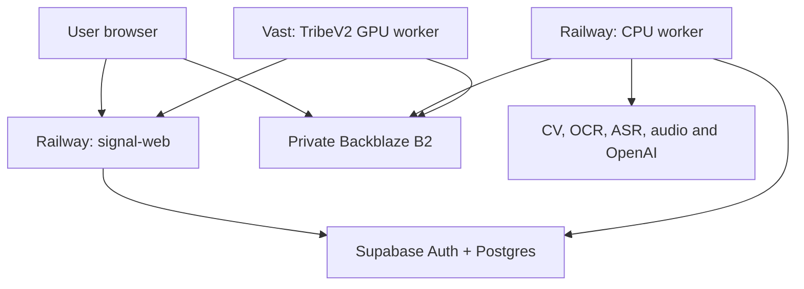

# Sakhaa Signal V1 — Evidence-Backed Creative Intelligence Design

**Date:** 2026-07-21
**Status:** Approved design
**Delivery approach:** Evidence-first vertical slices
**Repository strategy:** Refound the existing repository while preserving Git history and verified TribeV2 work

## 1. Product definition

Sakhaa Signal is an independent pre-flight Creative Intelligence product. A marketer uploads a static social-media creative or video/Reel and receives a private, versioned, evidence-backed diagnosis of how the creative is constructed, what is working, what may fail, and what to change before media spend begins.

The product combines:

- Direct media inspection and deterministic measurements.
- OCR, computer vision, transcription and audio-event evidence.
- GPT-5.6 Sol multimodal visual-semantic analysis and constrained synthesis.
- TribeV2 cognitive indicators for supported video.
- Versioned rules and deterministic scoring profiles.
- An immutable report in which every finding and recommendation cites evidence.

Sakhaa Signal does **not** predict CTR, CVR, CPA, ROAS, sales, virality, measured recall, eye tracking or actual brain activity. EP, VP, CS and BR are qualified model indicators, not observed audience outcomes.

## 2. Product and release boundaries

### Phase 1 V1 — User MVP

- Authentication and isolated single-member workspaces.
- Static and video upload/validation.
- Standard analysis and optional Full-with-TribeV2 analysis for supported video.
- Optional per-analysis brand references and platform/placement targeting.
- Durable progress, partial completion and retries.
- Evidence-backed measurements, rules, findings, recommendations and scoring.
- Web report and raw JSON.
- Retention, deletion and incremental TribeV2 upgrade.

### Phase 1 V2 — Admin operations

- Platform service/queue/cost/readiness dashboard.
- Cross-workspace content inspection under the approved audit policy.
- Retry/cancel/reprocess controls.
- User suspension, credits/plan overrides, retention overrides, feature flags and maintenance controls.

The `SUPER_ADMIN` role may exist in V1 for future compatibility, but the admin product surface and customer mutations must not delay or broaden V1.

### Deferred broader roadmap

- Multi-user workspace invitations and roles.
- Persistent brand profiles and custom rule builder.
- Full synchronized timeline and comparison workspace.
- PDF/bundle sharing and feedback/corrections.
- Performance-platform integrations, benchmarks and outcome models.
- Creative generation, variants and direct launch.

Forge generation, publishing, viral-candidate, acquisition and blueprint domains are outside the Signal runtime and schema.

## 3. Governing delivery approach

Development proceeds through three customer-facing vertical slices:

1. Static Standard Analysis.
2. Video Standard Analysis.
3. Full Video Analysis with TribeV2.

Every relevant slice includes UI, durable jobs, real engines, GPT visual analysis, evidence normalization, deterministic measurements/rules/scoring, an evidence-first report, failure handling, authorization, retention, observability and end-to-end verification.

Foundation work only unlocks the next vertical slice. It must not become an engine-first horizontal program that delays usable customer journeys. Fixtures and simulators are explicit non-production adapters and can never become production customer reports.

## 4. System architecture

### Railway services

#### `signal-web`

- Public Next.js standalone application and API.
- Supabase authentication and workspace authorization.
- Upload authorization/completion, job creation/progress and report APIs.
- Narrowly scoped outbound-worker coordination endpoints.
- No long-running analysis inside request handlers.

#### `signal-cpu-worker`

- Private always-on process with no public domain.
- Claims analysis jobs from Supabase Postgres.
- Runs media preprocessing and orchestrates non-GPU engines.
- Normalizes evidence, calculates measurements/rules/scores and validates reports.

#### `signal-maintenance`

- Scheduled/controlled cleanup and reconciliation entrypoint.
- Recovers stale leases, expires retained media, cleans orphan artifacts and retries failed deletion.

### Vast service

#### `tribev2-gpu-worker`

- Versioned verified GPU image.
- Claims only isolated `tribe_inference` tasks through outbound HTTPS.
- Downloads/returns task artifacts using short-lived B2 URLs.
- Does not own the overall analysis job or require an inbound public port.

### Managed dependencies

- Supabase Auth/Postgres for identity and durable state.
- Backblaze B2 for private media/evidence/report artifacts.
- Google Vision/Video Intelligence for applicable OCR/CV evidence.
- Groq Whisper for timestamped transcription.
- YAMNet for supported audio-event analysis.
- OpenAI Responses API with GPT-5.6 Sol for multimodal semantic vision and synthesis.

Vercel is not part of the approved Phase 1 architecture.

## 5. User analysis contract

### Upload envelope

- Static: JPEG, PNG or WebP; maximum 25 MB.
- Video: MP4, MOV or WebM; maximum 500 MB and 180 seconds.

File extension and client MIME type are not authoritative. Quarantined uploads are inspected with bounded tooling for actual type, byte length, streams, codec, duration, dimensions and decoder safety before paid engines run.

### Optional context

For each analysis, the user may provide:

- Brand name and aliases.
- Logo/reference images.
- Expected colours.
- Product names and short notes.
- Target platform and placement.

No target selection means a Generic creative profile and platform rules `NOT_REQUESTED`. The system never infers the target platform from aspect ratio or style.

### Analysis modes

Supported video requires an explicit unselected choice:

- `STANDARD_NO_TRIBEV2`
- `FULL_WITH_TRIBEV2`

The UI compares capabilities, measured expected time and eventual cost before confirmation. Static media follows the applicable Standard path and full video-trained TribeV2 is `NOT_APPLICABLE`.

The mode is immutable for a job attempt and included in idempotency, caching, scoring profile and exported JSON.

## 6. Vertical slice 1 — Static Standard Analysis

Complete flow:

1. Authenticate and authorize the single-member workspace.
2. Upload directly to a server-generated private B2 quarantine key.
3. Validate and create canonical static media identity.
4. Run OCR and static CV.
5. Calculate deterministic pixel, geometry, contrast, text and safe-zone measurements.
6. Run GPT-5.6 Sol multimodal vision on the complete creative with structured evidence context and optional overlays.
7. Normalize evidence and apply applicable generic/platform/per-analysis brand rules.
8. Calculate category scores and Overall Creative Score — Standard Profile.
9. Validate and publish an immutable evidence-first report and raw JSON.
10. Apply retention/deletion lifecycle.

TribeV2 and strictly video/audio/temporal dimensions are `NOT_APPLICABLE` and never fabricated.

## 7. Vertical slice 2 — Video Standard Analysis

Complete flow:

1. Perform the shared authorized upload/validation lifecycle.
2. Inspect/normalize through versioned FFmpeg/ffprobe profiles.
3. Extract shots, representative frames, audio and technical metadata.
4. Run video OCR/CV, transcript, audio-event and deterministic temporal/motion analysis.
5. Build deterministic GPT frame packets and run multimodal visual-semantic analysis.
6. Normalize evidence, measurements and applicable rules.
7. Calculate category scores and Overall Creative Score — Standard Profile.
8. Validate/publish an immutable report and raw JSON.
9. Preserve compatible source/intermediates for a later TribeV2 upgrade within retention.

TribeV2, EP, VP, CS and BR are `NOT_REQUESTED`.

## 8. Vertical slice 3 — Full Video Analysis with TribeV2

The Full slice adds to the complete Video Standard flow:

1. Create an isolated leased TribeV2 task after compatible preprocessing is available.
2. Execute the verified real video/audio/text/fusion/brain-prediction pipeline on Vast.
3. Persist versioned raw/derived artifacts, HCP mappings and 17-cluster outputs.
4. Calculate the four versioned model indicators:
   - Engagement Potential (`EP`).
   - Virality Potential (`VP`).
   - Conversion Strength (`CS`).
   - Brand Recall Indicator (`BR`).
5. Calculate the Full Overall Creative Score through a visible deterministic profile.
6. Give supported Tribe evidence to the final GPT synthesis alongside CV/OCR/audio/visual evidence.
7. Validate and publish the immutable Full report.

If TribeV2 fails, the job may publish `COMPLETED_PARTIAL` with the eligible Standard-profile Overall score. EP/VP/CS/BR show their real requested-stage failure state. Missing Tribe weights are never redistributed and no Full score is fabricated.

Adding TribeV2 to a completed Standard video creates a new immutable report version. Preprocessing is reused only when source hashes, artifact hashes and versioned preprocessing/input contracts match.

## 9. Durable orchestration

Supabase Postgres is the durable source of truth. Phase 1 does not require Redis merely to connect Railway and Vast.

Every job/stage attempt records:

- Workspace/job/stage identity.
- Input/version fingerprint.
- Attempt number.
- Lease owner and opaque lease token.
- Lease expiry and heartbeat.
- State, timestamps and sanitized error.
- Output/artifact identity.

Claims are atomic. Completion is compare-and-set against the current attempt/lease. Late results are diagnostic only and cannot overwrite a newer attempt.

The system provides at-least-once execution with idempotent effects, not a false exactly-once guarantee.

### Terminal job states

- `COMPLETED`
- `COMPLETED_PARTIAL`
- `FAILED`
- `CANCELLED`

### Engine/applicability states

- `AVAILABLE`
- `NOT_REQUESTED`
- `NOT_APPLICABLE`
- `NOT_DETECTED`
- `UNAVAILABLE`
- `LOW_CONFIDENCE`
- `FAILED`

An independent engine failure invalidates only dependent outputs. Indispensable media/evidence/report-integrity failures fail publication.

In-memory production job databases, request background tasks, synchronous GPU callbacks and successful-looking results-page mock fallbacks are prohibited.

## 10. Evidence model

Every output belongs to one explicit layer:

| Layer | Purpose |
|---|---|
| Observation | Raw normalized engine result |
| Measurement | Deterministic calculation from evidence |
| Rule result | Versioned expected-versus-actual check |
| Semantic judgment | Evidence-linked GPT interpretation |
| Score component | Deterministic profile input |
| Finding | Evidence-backed conclusion |
| Recommendation | Prioritized evidence-backed change |

Every record carries workspace/job/report ownership, producer, model/engine/profile version, applicability, confidence/quality, input fingerprint and evidence/artifact references.

Brand/logo findings distinguish `KNOWN_LOGO_API`, `REFERENCE_MATCH`, `UNCONFIRMED` and `NOT_DETECTED`. GPT cannot promote a visual guess into confirmed identity.

## 11. GPT-5.6 Sol multimodal design

GPT-5.6 Sol is a real semantic-vision engine and a constrained synthesis engine, not a generic prompt over OCR text.

### Static packet

- Canonical full creative.
- Optional unobtrusive OCR/logo/CTA/safe-zone overlays or crops.
- Dimensions and normalized boxes.
- OCR/CV/measurement, platform and brand context.

### Video packet

- Dense hook/opening frames.
- Representative shot frames.
- Brand/product/CTA/text reveal frames.
- Material scene/layout-change frames.
- Closing/end-card frames.

Every submitted image/frame has an immutable evidence ID and timestamp/provenance. Frame budgets and batching are deterministic and versioned. Near-identical frames are deduplicated deterministically.

Image detail is explicit: normally `high`, with `original` reserved for bounded dense/spatially sensitive creatives. Image count, dimensions, detail, tokens, latency and cost are recorded.

GPT may interpret visual hierarchy, composition, clutter, focal emphasis, reading/viewing order, brand/CTA integration, platform-overlay suitability and cross-frame narrative coherence.

Exact coordinates, sizes, contrast, duration, safe-zone intersection and timing remain deterministic measurements. GPT never returns final Overall/EP/VP/CS/BR values.

Every GPT finding uses schema-constrained evidence IDs, confidence/limitation and an anchored rubric where applicable. Unknown/cross-job evidence IDs and unsupported claims fail validation. Invalid output receives bounded repair attempts and otherwise fails visibly.

User notes, filenames, OCR text, metadata and creative content are untrusted data, not instructions.

## 12. Rules and scoring

### Category evidence

Applicable categories include:

- Hook/opening.
- Copy clarity and legibility.
- CTA.
- Visual construction.
- Branding.
- Video pacing/hold.
- Audio/sound-off.
- Platform/brand compliance.
- TribeV2 cognitive indicators.
- Analysis confidence/reliability.

Rules record code, expected value, actual value, status, severity, evidence IDs and versioned rule-set identity. Platform requirements and product best-practice recommendations are distinct.

### Full score hierarchy

1. Category measurements/rules/anchored semantic rubrics.
2. Four deterministic EP/VP/CS/BR profiles.
3. One visible weighted Overall Creative Score — Full Profile.

### Standard score hierarchy

1. Supported non-Tribe category components.
2. One Overall Creative Score — Standard Profile.
3. EP/VP/CS/BR `NOT_REQUESTED`.

Standard and Full profiles are distinct instruments. They cannot be ranked directly until a validated bridge establishes comparability.

Every profile declares inputs, transforms, weights, bounds, applicability, missing-data behaviour, confidence/coverage gates and version. `FAILED`, `UNAVAILABLE`, `NOT_REQUESTED` and `NOT_APPLICABLE` never become zero. Per-creative min-max normalization is prohibited.

All displayed scores must reconstruct exactly from persisted components. Provisional/calibration status is visible. Scores do not make outcome-performance claims.

## 13. Report design and publication

Report order:

1. Analysis state and capability/scoring profile.
2. Overall score and EP/VP/CS/BR where supported.
3. Executive diagnosis and evidence gaps.
4. Prioritized actions.
5. Category findings with nearby evidence.
6. Measurements and rule results.
7. TribeV2 details where available.
8. Methodology, versions and raw JSON.

Before publication, validation proves:

- Evidence references exist and belong to the same workspace/job/version.
- Derived values and score totals reconstruct.
- Capability/profile/partial labels are accurate.
- GPT findings use valid evidence and rubric values.
- Prohibited outcome/neuroscience/eye-tracking/recall claims are absent.
- No simulator/mock artifact entered a production report.

Reports are immutable. Retries, upgrades, platform re-evaluations and profile changes create linked versions.

## 14. Authorization, secrets and storage

- Every media/job/engine/evidence/score/report/artifact query is scoped by workspace and object identity.
- User-supplied arbitrary B2 keys are never signed.
- Object keys are generated server-side under authorized workspace/job prefixes.
- Signed URLs are short-lived and operation/object-specific.
- Railway and Vast use different minimum-scope credentials.
- Browser code receives no provider, storage-master or Supabase service-role secrets.
- Production configuration fails closed; default development worker tokens are prohibited.
- GPT image URLs/inputs come only from controlled authorized job artifacts.

The eventual `SUPER_ADMIN` may read customer content under the approved policy, but normal APIs remain workspace-scoped and admin access uses a separate server-authorized audited path.

## 15. Retention and deletion

- Original media and heavy reusable intermediates: 30-day default.
- Immediate authorized user deletion: supported.
- Minimal evidence needed to substantiate a retained report: report lifetime.
- After source expiry, TribeV2 upgrade/reprocessing requires re-upload when retained artifacts are insufficient.

Deletion states are `DELETE_REQUESTED`, `DELETING`, `DELETED` and `DELETE_FAILED`. Cleanup covers B2, database references, normalized media, frames, audio, tensors, caches and temporary files. Active-job races are cancelled/terminated safely before input deletion.

Deletion tombstones contain non-content proof only. Provider backup/retention limitations are disclosed accurately.

## 16. Observability and cost control

Trace identifiers link user requests, jobs, stages, provider calls, artifacts and report versions.

Metrics include:

- Queue depth/age, leases and retries.
- Per-engine latency/failure/confidence.
- Railway CPU/RAM/scratch/egress.
- Provider units/cost.
- Vast startup/inference/idle time.
- GPT image count/detail/tokens/cost.
- Cleanup/deletion backlog.

Concurrency budgets are separate for FFmpeg/CPU, external providers, GPT vision and GPU inference. Retryable calls use bounded exponential backoff and circuit breakers.

V1 operations use Railway/Vast/Supabase/B2 consoles plus structured logs/alerts. The consolidated dashboard is Phase 1 V2.

## 17. Repository refoundation

The existing repository and history are retained. Current branches remain prototype reference. Implementation later begins on a dedicated Signal V1 refoundation branch.

Intended structure:

- `apps/web`
- `apps/cpu-worker`
- `apps/gpu-worker`
- `packages/contracts`
- `packages/evidence`
- `packages/rules`
- `packages/scoring`
- `packages/database`
- `packages/test-fixtures`

Each current component is classified as verified reusable, reusable after repair, simulator/prototype only, Forge-specific or unsafe/misleading.

The authoritative Git-ignored local TribeV2 build is captured as a reproducible unit through asset/code manifests, SHA-256 checksums, pinned dependencies/base image and a clean-machine golden-video test. Restricted/large assets use controlled provisioning rather than public Git history.

Production startup refuses simulator mode and missing/mismatched real Tribe assets.

## 18. Verification gates

### Static Standard gate

- Real static upload reaches a reconstructable Standard report.
- GPT findings cite real creative/overlay/measurement evidence.
- Unsupported dimensions are never fabricated.

### Video Standard gate

- Real video produces timestamped OCR/CV/transcript/audio/temporal/GPT evidence.
- Worker/provider interruption recovers or yields an honest partial report.
- Standard score reconstructs exactly.

### Full Video gate

- Verified Vast image produces real 17-cluster and versioned EP/VP/CS/BR/Full outputs.
- Tribe failure follows the Standard partial fallback.
- Late/expired attempts cannot overwrite current output.
- Incremental upgrade reuses only compatible artifacts.

### Cross-cutting launch gate

- Cross-workspace and arbitrary-key attacks fail.
- Prompt injection cannot alter instructions/contracts.
- Malformed/near-limit media is bounded safely.
- Restart, timeout, stale lease, late result and deletion-race tests pass.
- Production simulator/mock startup or output is impossible.
- Clean checkout plus controlled artifacts builds/deploys all services.

## 19. Known accepted risks and unresolved implementation parameters

- Super-admin unrestricted read visibility creates a large compromise/insider blast radius and requires MFA, minimal membership, audit and anomaly alerts.
- Exact scoring weights/reference scales require a versioned product-approved provisional profile and later calibration; placeholders are prohibited.
- Supported platform/placement rule profiles require authoritative sources, effective/review dates and ongoing maintenance.
- Vast standard instance is the initial low-risk execution mode; Serverless/API-driven provisioning is evaluated after startup/demand telemetry.
- Provider quotas, cost and frame budgets must be validated with real representative media before commercial pricing or SLA claims.

## 20. Next workflow

This document is the approved design. It authorizes creation of an implementation plan, not application implementation by itself.

The next Superpowers workflow is `writing-plans`, producing an incremental plan aligned to the three vertical slices and their proof gates.
