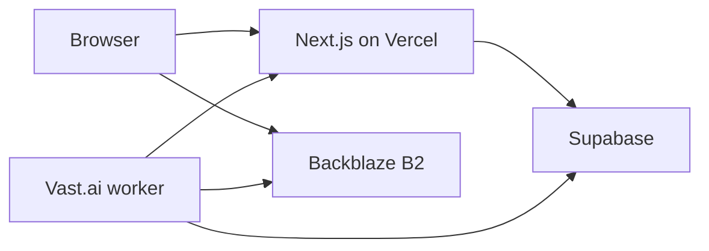
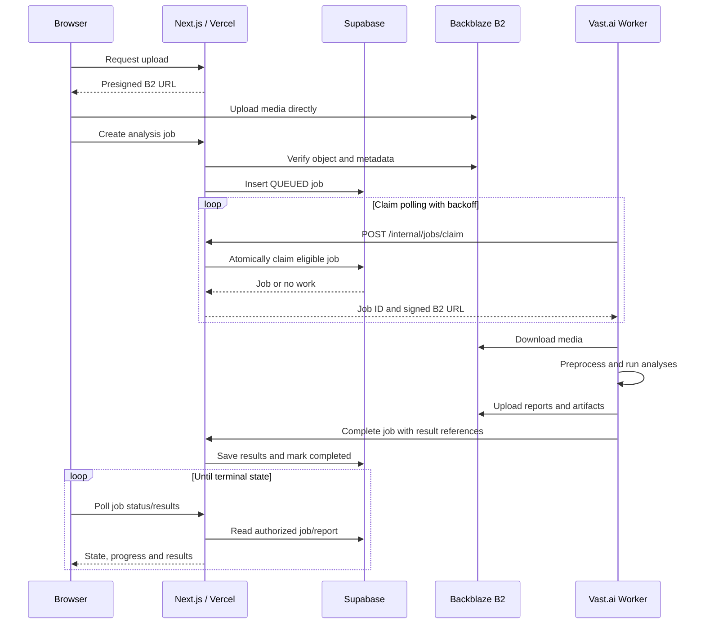
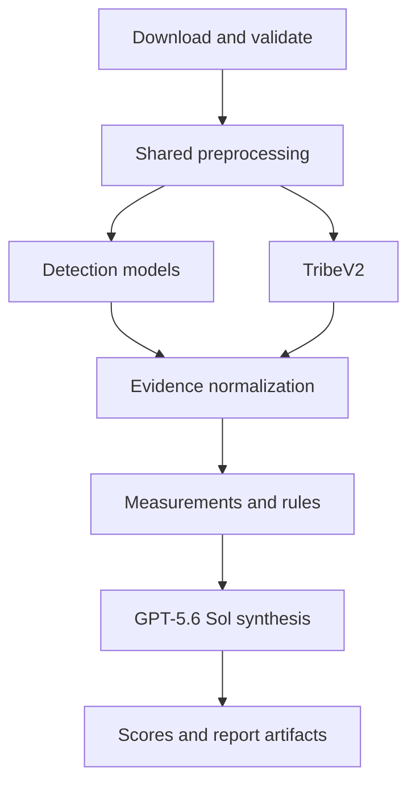
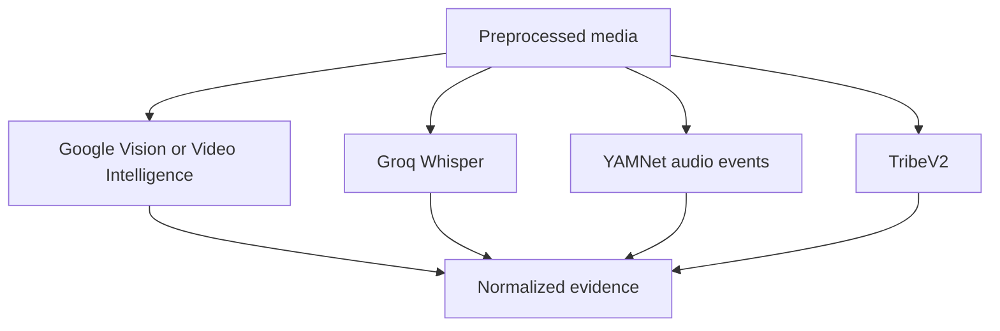
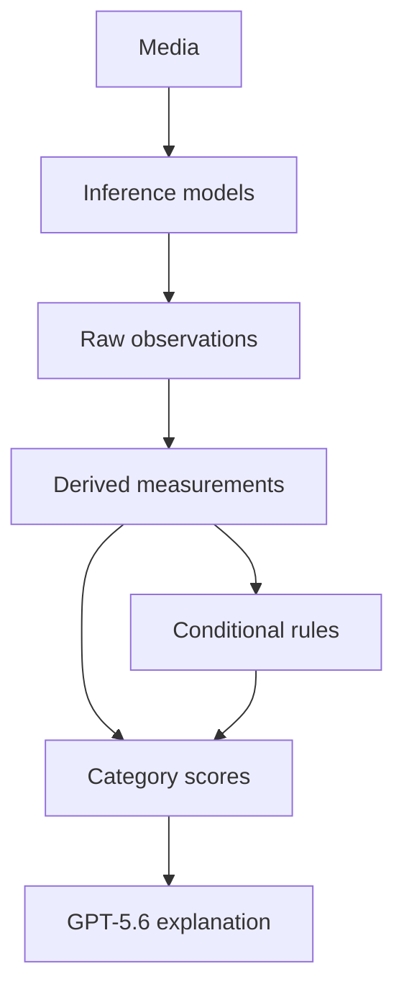
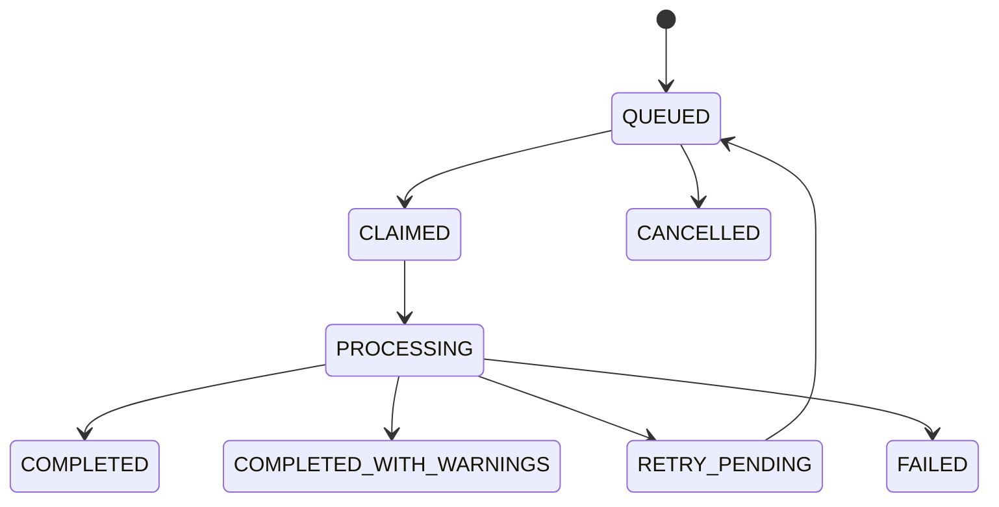

# Creative Intelligence Platform

## Product Definition, Feature Specification, Analysis Architecture, APIs and End-to-End System Design

**Document status:** V1 product and technical blueprint  
**Last updated:** 20 July 2026  
**Primary product mode:** Pre-flight creative analysis for static advertisements and videos/Reels  
**Core differentiator:** Evidence-backed creative analysis combined with TribeV2 modelled cognitive indicators

---

## 1. Executive summary

The Creative Intelligence Platform is a web application where a marketer uploads a static advertisement or video and receives a unified, evidence-backed report covering:

- What appears in the creative
- What copy is shown and spoken
- When important elements appear
- How readable and prominent those elements are
- Whether the creative follows platform and brand rules
- How effectively the hook, message, visual, branding, CTA and audio are constructed
- What TribeV2 predicts across its 17 cognitive clusters
- What should be changed, with frame-level and timestamp-level evidence

The application must not behave like a generic AI chatbot that watches an advertisement and returns an opinion. It must first produce measurable evidence through OCR, computer vision, speech recognition, media inspection and TribeV2. Deterministic code then calculates measurements and checks explicit rules. GPT-5.6 Sol interprets the combined evidence and produces marketer-facing findings and recommendations.

The core product promise is:

> Upload an advertisement and receive a structured diagnosis of what audiences see, read and hear; how the creative is constructed; what rules it violates; what TribeV2 predicts; and exactly what should be improved.

This is initially a **pre-flight creative diagnostic product**. It does not claim to predict CTR, CPA, CVR or ROAS until real advertising-platform performance data is connected and validated.

---

## 2. Problem being solved

Creative review is commonly subjective. A strategist may say that a hook feels weak, a CTA is late or a frame feels cluttered, but the reason and evidence are often not recorded consistently.

Existing creative-intelligence products address parts of this problem through:

- Media and campaign-performance aggregation
- Computer-vision tagging
- Creative element measurement
- Brand and platform compliance checks
- Predicted attention or cognitive models
- Generative recommendations and variants

The proposed product combines these ideas around the existing TribeV2 system. It will transform raw media into structured observations, measurements, rules, scores and recommendations rather than returning an unsupported universal score.

### 2.1 Primary users

- Performance marketers
- Creative strategists
- Advertising agencies
- Brand teams
- Media buyers
- Video editors and designers
- Internal reviewers and approvers

### 2.2 Primary user questions

The report must help answer:

1. Does the opening stop attention quickly enough?
2. Is the product or offer understandable?
3. Is the copy readable for long enough?
4. Is the CTA clear, visible and correctly timed?
5. Is the brand introduced effectively?
6. Is the creative visually coherent or cluttered?
7. Does the video pacing support the message?
8. Does the creative comply with its intended placement and brand rules?
9. What cognitive patterns does TribeV2 model across the creative?
10. What exact edits should the creative team make?

---

## 3. Product boundaries and truthfulness

The platform must clearly distinguish five kinds of output.

| Output type | Meaning | Example |
|---|---|---|
| Model detection | A specialist model detected an element | Google Video Intelligence detected a logo at 00:02.1 |
| Direct measurement | A value came directly from media or detection data | Video duration is 20 seconds |
| Derived measurement | Application code calculated a value | Logo is visible for 18.5% of the video |
| Rule result | A configured condition passed or failed | Brand visible within first 3 seconds: PASS |
| Semantic judgment | GPT-5.6 Sol interpreted evidence using a defined rubric | The opening communicates the discount but not the product benefit |

A score is a sixth layer: a versioned combination of measurements, rules and semantic rubric results.

The application must not present conditions such as `logo appears before three seconds` as separate AI engines. They are product rules evaluated against detections and measurements.

### 3.1 Claims the V1 product may make

- OCR-detected text and its position/timing
- Detected logos, people, objects and scene labels
- Measured text, logo and product coverage
- Measured timing, pacing, contrast and duration
- Rule compliance against explicit thresholds
- GPT-5.6 Sol semantic assessments backed by evidence
- TribeV2 modelled cognitive indicators
- AI-generated recommendations with confidence and provenance

### 3.2 Claims the V1 product must not make

- Guaranteed performance improvement
- Guaranteed CTR, CVR, CPA or ROAS
- Actual human eye-tracking results
- Exact percentage of viewers who saw an element
- Scientifically proven memory or recall
- Definitive statements about a person's internal emotion from a facial expression
- Legal approval of claims or disclaimers
- Full TribeV2 video-mode outputs for static creatives without a validated static calibration

---

## 4. Product modes

### 4.1 Video creative analysis

Video mode supports:

- Media inspection
- Shot and scene timing
- Dense opening analysis
- Video OCR and text tracking
- Speech transcription
- Audio-event analysis
- Logo, object, face and person tracking
- Product, brand and CTA reveal timing
- Pacing and motion measurements
- Platform and brand rules
- GPT-5.6 Sol interpretation of representative frames and evidence
- Full TribeV2 video analysis
- Synchronized evidence timeline

### 4.2 Static creative analysis

Static mode supports:

- Image metadata and quality
- OCR and copy analysis
- Logo, face, person and object detection
- Colour, contrast, composition and hierarchy analysis
- Product and CTA prominence
- Platform safe-zone and brand-rule checks
- GPT-5.6 Sol interpretation of the complete image and evidence

The complete video-trained TribeV2 pipeline must not be forced onto a static image by supplying zero audio or fake temporal values. Until a static-specific calibration exists, static reports must mark temporal, music, audio-visual binding and pacing dimensions as `NOT_APPLICABLE`. Any supported static TribeV2 dimensions must be explicitly versioned and validated before release.

---

## 5. Complete feature scope

## 5.1 Upload, projects and campaign context

The application will implement:

- Authentication and workspaces
- Projects and campaigns
- Static image upload
- Video/Reel upload
- Direct-to-Backblaze B2 upload using short-lived presigned URLs
- File-type, file-size and MIME validation
- Hashing and duplicate detection
- Campaign objective selection
- Target platform and placement selection
- Industry, product and target-audience context
- Optional brand profile selection
- Optional brand guideline and rule configuration
- Creative version tracking
- Analysis history
- Retry and cancellation
- Comparison of two creative versions

### Campaign context fields

- Campaign objective: awareness, traffic, leads, conversion, install or engagement
- Intended platform: Meta, Instagram Reels, YouTube, LinkedIn, TikTok or custom
- Placement: feed, story, Reel, Shorts, pre-roll or custom
- Target audience
- Product/service description
- Desired action
- Brand profile
- Required disclaimer
- Prohibited terms or claims

GPT-5.6 Sol must receive this context. A creative cannot be judged correctly against an unknown objective or placement.

---

## 5.2 Media preprocessing and technical inspection

### Technologies

- `ffprobe` for authoritative media metadata
- FFmpeg for frame/audio extraction and media transformations
- OpenCV for pixel-level measurements
- Perceptual hashing for duplicate/near-duplicate detection

### Direct outputs

- Container and codec
- Width and height
- Aspect ratio
- Duration
- Frame rate
- Bit rate
- File size
- Audio-stream availability
- Audio sample rate and channel count

### Derived outputs

- Opening frames, sampled more densely during the first three seconds
- Representative frame for each shot
- Product-reveal frame
- Brand-reveal frame
- CTA frame
- Final/end-card frames
- Extracted mono audio for transcription and audio classification
- Motion intensity
- Sharpness/blur measurement
- Black-frame intervals
- Silence intervals
- Loudness measurements

Preprocessing must occur once. TribeV2, computer vision, audio analysis and GPT-5.6 Sol must reuse the same normalized media artifacts wherever possible.

---

## 5.3 Computer-vision detections

Computer vision is responsible for locating and tracking observable elements. It is not responsible for producing the final marketing explanation.

### Static-image provider

**Google Cloud Vision API**

Use for:

- OCR text and bounding boxes
- Known-logo detection
- Face detection
- Object localization
- Image labels
- Image properties and dominant colours

Reference: <https://cloud.google.com/vision/docs>

### Video provider

**Google Cloud Video Intelligence API**

Use for:

- Shot-change detection
- OCR text detection and tracking
- Logo recognition and tracking
- Object detection and tracking
- Person detection and tracking
- Face detection
- Scene and activity labels

Reference: <https://cloud.google.com/video-intelligence/docs/features>

### Normalized computer-vision observations

Every observation should use a provider-independent schema:

```json
{
  "observationType": "LOGO_DETECTION",
  "label": "Example Brand",
  "startMs": 2100,
  "endMs": 5800,
  "boundingBox": {
    "x": 0.72,
    "y": 0.08,
    "width": 0.18,
    "height": 0.12
  },
  "confidence": 0.93,
  "provider": "GOOGLE_VIDEO_INTELLIGENCE",
  "providerModelVersion": "recorded-at-runtime"
}
```

The normalized schema prevents the report UI and scoring code from depending directly on one provider's response format.

### V1 limitation: custom brand assets

Known-logo APIs may not recognize smaller or new brands. V1 should allow uploaded brand references and record when logo matching is `KNOWN_LOGO_API`, `REFERENCE_MATCH` or `UNCONFIRMED`. A robust custom detector can be added later, but GPT-5.6 Sol must not silently turn a visual guess into a confirmed logo measurement.

---

## 5.4 OCR, copy and messaging analysis

OCR detection and copy interpretation are separate stages.

### Extraction stage

Google Vision or Video Intelligence produces:

- Extracted text
- Bounding box
- Start and end timestamps for video
- Detection confidence
- Frame/shot reference

### Deterministic measurements

- Text visibility duration
- Text coverage per frame
- Text density
- Word and character count
- Estimated reading time
- Reading-time deficit
- Text-background contrast
- Opening text load
- Number of simultaneous messages

### GPT-5.6 Sol semantic classification

GPT-5.6 Sol receives OCR, transcript, campaign context and supporting frames. It classifies:

- Headline
- Opening hook
- Primary message
- CTA
- Offer or discount
- Product benefit
- Product feature
- Proof or testimonial
- Objection handling
- Claim
- Disclaimer
- Urgency or scarcity language
- Message angle
- Audience/persona
- Awareness stage
- Benefit-versus-feature balance
- Message hierarchy
- Grammar and spelling issues
- Conflicting or missing messages

### Copy findings

Every finding must contain:

- Extracted text
- Frame or timestamp
- Classification
- Finding
- Evidence
- Severity
- Confidence
- Recommended correction
- Producing component

---

## 5.5 CTA analysis

CTA analysis combines OCR detections, semantic classification and deterministic measurements.

### Measurements

- Whether a CTA exists
- CTA text
- First appearance timestamp
- Total visibility duration
- Frame coverage
- Position
- Background contrast
- Platform safe-zone overlap
- Repetition count
- Presence on the end card

### Rules

- CTA must exist when required by the campaign objective
- CTA must appear before the configured cutoff
- CTA must remain visible for the estimated reading duration
- CTA must not overlap platform controls
- CTA contrast must exceed the configured threshold
- CTA wording must correspond to the desired action

### Semantic judgment

GPT-5.6 Sol evaluates:

- Wording clarity
- Relevance to the message and offer
- Strength and specificity
- Objective alignment
- Whether the user understands what happens after acting

CTA score is a composite score, not a separate AI model.

---

## 5.6 Visual and brand analysis

### Detected evidence

- Faces and people
- Objects and possible products
- Known logos
- Text regions
- Scene/activity labels
- Bounding boxes and timestamps

### Deterministic measurements

- Logo first appearance
- Logo screen duration and duration ratio
- Logo frame coverage
- Product first appearance
- Product screen duration and coverage
- Face/person duration and coverage
- Text coverage and density
- Simultaneous element count
- Dominant colours
- Colour distance from configured brand palette
- Subject position
- Safe-zone intersection
- Sharpness and contrast
- Visual consistency between sampled frames

### GPT-5.6 Sol visual judgments

- Visual hierarchy
- Main focal subject
- Composition and balance
- Perceived clutter
- Product prominence in context
- Brand integration quality
- Creative format: UGC, lifestyle, listicle, studio, founder story, testimonial, product demonstration or before/after
- Production style
- Platform nativeness
- First-frame effectiveness
- Thumbnail effectiveness
- End-card effectiveness
- Visible expression cues
- Emotional tone of the creative

Visible expression cues must not be presented as definitive knowledge of a person's internal emotional state.

---

## 5.7 Video and audio analysis

### Speech transcription

**Primary provider:** Groq Whisper API using `whisper-large-v3` or `whisper-large-v3-turbo`.

Use for:

- Timestamped transcript
- Word-level and segment-level timing
- Language detection/selection
- Audible brand and product mentions
- Narration and spoken CTA extraction

Reference: <https://console.groq.com/docs/speech-to-text>

Google speech transcription can be retained as a provider fallback if desired.

### Audio-event classification

**Model:** YAMNet, running locally on CPU in the analysis worker.

Use for:

- Speech presence
- Music presence
- Common sound-effect/event classes
- Audio-event timeline

### Deterministic audio measurements

- Silence intervals
- Integrated loudness
- Loudness range
- Peak audio level
- Voice/music overlap
- Sound-on and sound-off suitability
- Caption availability
- Approximate caption/transcript synchronization

### Video structure measurements

- Shot count
- Cut frequency
- Average and median shot duration
- Opening shot duration
- Static or low-motion intervals
- Product reveal time
- Brand reveal time
- CTA reveal time
- End-card duration
- Caption continuity

### GPT-5.6 Sol video judgments

GPT-5.6 Sol sees representative images plus the full structured timeline. It evaluates:

- Hook construction
- Pacing relative to message density
- Narrative coherence
- Problem/solution/proof/offer/CTA structure
- Audio-message alignment based on transcript and event data
- Whether visual changes support the spoken message
- Whether the video works without sound

GPT-5.6 Sol does not receive the raw video or raw audio. It receives images, transcript and structured evidence through the OpenAI Responses API.

Reference: <https://developers.openai.com/api/docs/models/gpt-5.6-sol>

---

## 5.8 TribeV2 cognitive analysis

TribeV2 remains the only neuro/cognitive model in V1.

### Existing 17 clusters

1. Visual processing
2. Face and scene perception
3. Theory of Mind
4. Arousal
5. Episodic memory
6. Value and self-relevance
7. Language
8. Music
9. Attention
10. Cognitive friction
11. Motor/action response
12. Surprise
13. Audio-visual binding
14. Trust
15. Aesthetics
16. Valence
17. Narrative processing

### TribeV2 outputs

- Per-cluster score
- Activation over time
- Highest-activation intervals
- Lowest-activation intervals
- Attention-drop intervals
- Cognitive-friction peaks
- Emotional progression
- Narrative progression
- Audio-visual alignment
- Supporting frame references
- Raw prediction artifacts
- Model and pipeline version
- Confidence/quality metadata where available

The UI should call these **modelled cognitive indicators**. It must not claim that the system measured a specific viewer's actual brain activity.

### No separate attention or eye-tracking model in V1

V1 will not implement:

- Eye-tracking heatmaps
- Predicted gaze order
- Percentage-seen claims
- Product gaze share
- CTA gaze share

The application may calculate `visualProminence` from size, contrast, position, duration and isolation, but must not rename it `attentionShare`. TribeV2's Attention cluster remains the cognitive attention indicator.

---

## 5.9 Brand and platform rules

Rules are conditions implemented in ordinary application code. They use detected and calculated evidence.

### Platform rules

- Accepted aspect ratio
- Resolution requirements
- Maximum/minimum video length
- Platform safe zones
- CTA overlap with platform controls
- Subtitle presence
- Subtitle legibility
- Sound-off suitability
- Thumbnail requirements
- End-card duration

### Brand rules

- Brand visible within first N seconds
- Minimum brand screen time
- Logo size and permitted position
- Brand-colour tolerance
- Required disclaimer
- Prohibited terms or claims
- Required product or brand mention
- Required audible brand mention
- CTA wording requirements

### Rule result schema

```json
{
  "ruleCode": "BRAND_VISIBLE_FIRST_3_SECONDS",
  "status": "PASS",
  "expected": "firstLogoAppearanceMs <= 3000",
  "actual": 2100,
  "evidenceIds": ["obs_logo_2100"],
  "severity": "HIGH",
  "ruleSetVersion": "meta-reels-v1"
}
```

Rule sets must be versioned so that an old report remains reproducible after thresholds change.

---

## 5.10 Scoring system

The product should expose separate category scores instead of relying on one unexplained universal score.

### V1 category scores

- Hook
- Copy clarity
- CTA
- Visual construction
- Branding
- Video pacing/hold
- Audio
- Platform and brand compliance
- TribeV2 cognitive indicators
- Analysis confidence

An optional Overall Creative Score may be displayed only when its weighting is visible.

### Example CTA scoring profile

| Factor | Weight |
|---|---:|
| CTA detected | 15% |
| Appears within configured window | 20% |
| Visible for adequate reading time | 15% |
| Contrast | 15% |
| Size and visual prominence | 15% |
| Wording clarity rubric | 10% |
| Campaign-objective alignment rubric | 10% |

### Example branding scoring profile

| Factor | Weight |
|---|---:|
| Brand appears early enough | 25% |
| Brand exposure duration | 20% |
| Logo/product prominence | 15% |
| Audible brand mention | 15% |
| Brand-colour adherence | 10% |
| GPT-5.6 brand-integration rubric | 15% |

All score profiles must have:

- Profile name
- Version
- Applicable platform/placement
- Input feature definitions
- Weighting
- Missing-data behaviour
- Minimum confidence requirements

Missing data must not be silently converted to zero. Use `NOT_APPLICABLE`, `NOT_DETECTED`, `UNAVAILABLE` or `LOW_CONFIDENCE` explicitly.

---

## 5.11 Findings and recommendations

Every recommendation must be traceable.

Required fields:

- Problem
- Evidence
- Timestamp or frame
- Bounding box when relevant
- Affected score
- Likely creative consequence
- Recommended modification
- Priority
- Confidence
- Producing component

Example:

> The CTA first appears at 00:12.4, after 62% of the video has elapsed. It remains visible for 0.9 seconds while the estimated reading time is 1.8 seconds. Introduce a lightweight action cue before 00:05 and retain the complete CTA on the end card for at least two seconds.

The LLM must only cite evidence IDs that exist in the normalized evidence store.

---

## 6. User-facing application

## 6.1 Required screens

1. Sign in and workspace selection
2. Dashboard and recent analyses
3. New analysis
4. Upload and campaign context
5. Processing/progress
6. Creative overview
7. Timeline and evidence viewer
8. Copy and CTA analysis
9. Visual and brand analysis
10. Video and audio analysis
11. TribeV2 cognitive report
12. Platform and brand compliance
13. Recommendations
14. Creative comparison
15. Reports and exports
16. Brand profiles and rule settings

## 6.2 Report overview

The overview should show:

- Category scores
- Overall score with visible weighting, if enabled
- Analysis confidence
- Top strengths
- Highest-priority problems
- Prioritized recommendations
- Creative thumbnail/player
- Processing warnings or unavailable dimensions

## 6.3 Evidence timeline

For video, synchronize:

- Video playback
- Shot boundaries
- OCR text
- Transcript
- Logo/product/face/person presence
- CTA appearance
- Audio events
- TribeV2 activation tracks
- Findings and recommendations

Clicking a finding must seek the video to the relevant timestamp and display its evidence frame.

## 6.4 Creative comparison

Comparison supports:

- Two creative versions side by side
- Category-score differences
- Hook, CTA and branding changes
- Text-density and reading-time changes
- Logo/product exposure changes
- Rule regressions and improvements
- TribeV2 cluster differences
- Recommendation resolution status

Comparison reports should describe what changed, not declare a guaranteed winner without performance data.

## 6.5 Exports

- Interactive web report
- PDF report
- Structured JSON
- Timeline CSV
- OCR output
- Transcript
- Keyframes
- Rule-result export
- TribeV2 raw outputs
- Complete analysis artifact bundle
- Shareable report link with access control

---

## 7. Technology stack

| Layer | Technology | Responsibility |
|---|---|---|
| Web application | Next.js, React, TypeScript | Dashboard, upload, reports and comparison UI |
| Hosting | Vercel | Next.js deployment and API entry points |
| Authentication | Supabase Auth | User identity and workspace access |
| Database | Supabase Postgres | Jobs, evidence, findings, rules, scores and references |
| ORM | Prisma | Typed database access and migrations |
| Object storage | Backblaze B2 S3-compatible API | Original media, frames, transcripts and report artifacts |
| Worker API | FastAPI and Uvicorn | Job claiming, orchestration and analysis execution |
| Containerization | Docker | Reproducible CPU/GPU worker image |
| GPU compute | Vast.ai initially | TribeV2 inference |
| Media processing | FFmpeg and ffprobe | Metadata, frame extraction and audio extraction |
| Pixel analysis | OpenCV | Contrast, colour, blur, motion and geometry |
| Static CV | Google Cloud Vision | OCR, logos, faces, objects and labels |
| Video CV | Google Video Intelligence | Shots, OCR tracking, logos, objects, people and labels |
| Speech recognition | Groq Whisper API | Timestamped multilingual transcription |
| Audio events | YAMNet | Speech/music/audio-event classification |
| Cognitive model | TribeV2 | 17-cluster cognitive indicators |
| Semantic reasoning | OpenAI Responses API with GPT-5.6 Sol | Creative interpretation and recommendations |
| Rule evaluation | Versioned TypeScript or Python rule modules | Platform and brand conditions |
| Scoring | Versioned scoring profiles | Category and optional overall scores |

### 7.1 Environment and secret groups

Secrets must remain server-side or worker-side.

Groups include:

- Supabase URL, database and JWT configuration
- Backblaze B2 endpoint, key ID, application key and bucket names
- Google Cloud service-account credentials
- Groq API key
- OpenAI API key
- Worker authentication token/HMAC secret
- Report-sharing signing secret

No provider key may be exposed in browser JavaScript.

---

## 8. System architecture

## 8.1 Outer system architecture

This preserves the architecture in the supplied diagram.



### Responsibilities

#### Browser

- Authenticated user interface
- Upload directly to B2 with a presigned URL
- Submit campaign context
- Poll job state in V0
- Display reports and evidence

#### Next.js/Vercel

- Authorize every user request
- Create presigned B2 upload URLs
- Validate upload completion
- Create analysis jobs
- Expose worker-only claim/heartbeat/completion endpoints
- Return report data and signed artifact links

#### Supabase

- Authentication
- Tenant/workspace authorization data
- Analysis queue and leases
- Engine-run states
- Evidence, measurements, rules, scores and findings
- Artifact references

#### Backblaze B2

- Private raw/quarantine uploads
- Private analysis artifacts
- Keyframes and previews
- Transcript/OCR exports
- TribeV2 bundles
- Report files

#### Vast.ai worker

- Claim jobs
- Download media
- Run shared preprocessing
- Run TribeV2 on GPU
- Call external CV, speech and reasoning APIs
- Calculate measurements, rules and scores
- Upload artifacts
- Complete or fail jobs

---

## 8.2 End-to-end sequence based on the supplied diagram



Supabase Realtime may replace browser polling later, but polling is sufficient for V1 and matches the current design.

---

## 8.3 Expanded internal worker pipeline

The `Run creative analysis` step in the supplied diagram expands into the following pipeline.



### Detection-model fan-out



Independent branches should run concurrently when the provider quotas and worker resources allow it.

---

## 8.4 Correct analysis-layer separation



GPT-5.6 Sol receives:

- Campaign context
- Representative frames
- Normalized CV observations
- OCR timeline
- Transcript
- Audio events
- Derived measurements
- Rule results
- TribeV2 outputs
- Score components

It must return structured JSON conforming to the report schema. It must not invent missing detections or cite evidence that does not exist.

---

## 8.5 Worker hosting profiles

### Profile A: simplest V1 deployment

Run the complete Docker worker on Vast.ai.

Advantages:

- Closest to the existing container
- One deployment target
- Shared FFmpeg preprocessing
- Simple operational model

Trade-off:

- The GPU instance is billed while it remains running, including time spent waiting for jobs or external APIs.

### Profile B: recommended production split

Split the worker into:

1. **CPU analysis orchestrator** for preprocessing, Google/Groq/OpenAI calls, measurements, rules and reporting.
2. **GPU TribeV2 worker** for the cognitive pipeline only.

The CPU orchestrator can use a scale-to-zero service. The TribeV2 worker can remain on Vast.ai initially or move behind a serverless GPU job endpoint later. This avoids using GPU time for OCR API calls and ordinary rule checks.

The application should define a provider abstraction such as `TribeExecutionProvider` so that `VAST_AI`, `MODAL` or another deployment can be selected without changing report schemas.

---

## 9. Job orchestration and reliability

## 9.1 Job states



Detailed progress stages:

1. `QUEUED`
2. `CLAIMED`
3. `DOWNLOADING`
4. `VALIDATING`
5. `PREPROCESSING`
6. `COMPUTER_VISION`
7. `TRANSCRIPTION`
8. `AUDIO_ANALYSIS`
9. `TRIBEV2_ANALYSIS`
10. `DERIVING_MEASUREMENTS`
11. `EVALUATING_RULES`
12. `SEMANTIC_SYNTHESIS`
13. `SCORING`
14. `UPLOADING_RESULTS`
15. `COMPLETED`, `COMPLETED_WITH_WARNINGS`, `FAILED` or `CANCELLED`

## 9.2 Atomic claiming

Job claiming must occur through one atomic PostgreSQL operation or RPC:

- Select one eligible `QUEUED` or expired-lease job
- Lock it
- Assign `worker_id`
- Set `lease_expires_at`
- Increment attempt count
- Return job data

This prevents two workers from processing the same job.

## 9.3 Lease and heartbeat

- Worker sends heartbeat during long analysis
- Heartbeat extends the lease
- Expired lease makes a non-terminal job eligible for retry
- A worker must verify lease ownership before completion

## 9.4 Idempotency

- Upload completion uses an idempotency key
- Job creation uses a client request ID
- Each engine run has a deterministic input/version fingerprint
- Artifact paths include job ID and engine-run ID
- Completion can be safely retried
- Existing successful engine output may be reused when the fingerprint matches

## 9.5 Partial completion

Required engines:

- Preprocessing
- Computer vision/OCR
- Measurement and rules
- Semantic synthesis

Conditional engines:

- Transcription, when audio exists
- YAMNet, when audio exists
- TribeV2, for supported video mode

An optional failure may result in `COMPLETED_WITH_WARNINGS`. The report must state which dimensions are unavailable.

---

## 10. Database design

| Entity | Purpose |
|---|---|
| `workspaces` | Tenant boundary |
| `users` / membership tables | Workspace access and roles |
| `projects` | Group campaigns and analyses |
| `campaign_contexts` | Objective, audience, platform and product context |
| `brand_profiles` | Brand colours, references and defaults |
| `brand_rules` | Versioned brand-specific rules |
| `media_assets` | Uploaded object metadata and hashes |
| `creative_versions` | Relationships between iterations |
| `analysis_jobs` | Top-level job lifecycle |
| `analysis_engine_runs` | Per-model/service attempt and status |
| `media_frames` | Keyframe metadata and artifact references |
| `observations` | Raw normalized detections and model outputs |
| `derived_metrics` | Calculated measurements |
| `rule_results` | Versioned condition results |
| `scores` | Category and component scores |
| `findings` | Evidence-backed problems and strengths |
| `recommendations` | Prioritized proposed changes |
| `artifacts` | B2 object references and content metadata |
| `feedback` | User corrections and recommendation acceptance |

### Engine-run fields

- Engine code
- Provider
- Model/pipeline version
- Input fingerprint
- Status
- Started/completed timestamps
- Attempt count
- Confidence/quality metadata
- Error code and sanitized error message
- Raw-result artifact reference

Do not store very large raw responses directly in Postgres. Store large bundles in B2 and retain structured summaries and references in the database.

---

## 11. Object-storage design

### Existing buckets

- `B2_BUCKET_QUARANTINE`: private raw uploads
- `B2_BUCKET_PRIVATE_ARTIFACTS`: private outputs and bundles
- `B2_BUCKET_CLEAN_MEDIA`: optional normalized/approved media if activated later

### Suggested object layout

```text
quarantine/{workspaceId}/{assetId}/original.ext
artifacts/{workspaceId}/{jobId}/preprocessing/metadata.json
artifacts/{workspaceId}/{jobId}/frames/{timestampMs}.jpg
artifacts/{workspaceId}/{jobId}/ocr/ocr.json
artifacts/{workspaceId}/{jobId}/transcript/transcript.json
artifacts/{workspaceId}/{jobId}/tribev2/raw/
artifacts/{workspaceId}/{jobId}/report/report.json
artifacts/{workspaceId}/{jobId}/report/report.pdf
artifacts/{workspaceId}/{jobId}/bundle/analysis-bundle.zip
```

Objects remain private. Browser access uses short-lived signed download URLs issued after workspace authorization.

---

## 12. API surface

### Browser-facing endpoints

| Method and path | Purpose |
|---|---|
| `POST /api/uploads/presign` | Authorize and prepare direct B2 upload |
| `POST /api/uploads/complete` | Verify uploaded object and register media asset |
| `POST /api/analysis-jobs` | Create an analysis job |
| `GET /api/analysis-jobs/:id` | Return state and progress |
| `POST /api/analysis-jobs/:id/cancel` | Request cancellation |
| `GET /api/analysis-jobs/:id/report` | Return the authorized structured report |
| `GET /api/artifacts/:id/download` | Return a signed artifact URL |
| `POST /api/analyses/compare` | Compare compatible creative reports |
| `POST /api/findings/:id/feedback` | Record user correction/feedback |

### Worker-only endpoints

| Method and path | Purpose |
|---|---|
| `POST /internal/jobs/claim` | Atomically claim one eligible job |
| `POST /internal/jobs/:id/heartbeat` | Extend lease and update progress |
| `POST /internal/jobs/:id/complete` | Commit result references and terminal state |
| `POST /internal/jobs/:id/fail` | Record retryable or terminal failure |
| `POST /internal/jobs/:id/release` | Release a safely abandoned job |

Worker endpoints require service authentication and must not be available to ordinary browser sessions.

---

## 13. Security and privacy

- Supabase Auth validates user identity
- Row-level or service-layer authorization enforces workspace ownership
- Upload URLs are short-lived and scoped to one object key
- Download URLs are short-lived and issued only after authorization
- B2 buckets remain private
- Worker endpoints use a worker credential or signed request
- Worker credentials are rotated
- Provider API keys remain server-side
- Uploaded MIME type, magic bytes, extension and size are validated
- File hashes are stored
- Unsafe or malformed media fails before model execution
- Logs exclude secrets, full signed URLs and sensitive raw content
- Data-retention and deletion policies apply to originals and generated artifacts
- Free developer API tiers must not be assumed suitable for confidential client media; provider data-use terms must be reviewed before production
- Report-sharing links require revocation and expiry

---

## 14. Observability

Track:

- Jobs created, completed, failed and cancelled
- Queue wait time
- Processing time by stage
- GPU runtime
- External API latency and failure rate
- Tokens and cost by GPT request
- CV units/minutes consumed
- ASR duration consumed
- Artifact size
- Retry count
- Worker heartbeat and lease expiration
- Model/pipeline versions
- Score-profile and rule-set versions

The admin view should allow an operator to determine whether a failure came from upload, preprocessing, a provider API, TribeV2, report synthesis or artifact upload.

---

## 15. Cost-control principles

- Upload directly to B2 rather than proxying media through Vercel
- Preprocess once and reuse artifacts
- Call GPT-5.6 Sol with selected frames and structured evidence rather than every video frame
- Use deterministic code for simple conditions
- Skip audio services when no audio exists
- Skip video-only stages for static creatives
- Cache engine outputs by input and model fingerprint
- Set provider quotas, budgets and alerting
- Run independent external APIs concurrently
- Separate CPU orchestration from GPU execution when usage grows
- Allow TribeV2 to be retried without repeating successful OCR/CV calls

---

## 16. Feedback and future learning

V1 should collect structured feedback rather than offering immediate fine-tuning.

Users may:

- Mark a finding correct or incorrect
- Correct detected CTA/headline/offer classifications
- Confirm or reject logo/product detections
- Accept, reject or edit a recommendation
- Add brand-specific rules
- Mark a creative version as preferred
- Later attach actual campaign metrics

This creates future training data for:

- Brand-specific semantic rubrics
- Recommendation ranking
- Creative comparison
- Outcome prediction
- Performance-factor calibration

---

## 17. Features intentionally postponed

The following should not block V1:

- Meta, Google, TikTok and LinkedIn ad-account integrations
- CTR, CVR, CPA and ROAS prediction
- Creative fatigue detection
- Automatic winner prediction
- Competitor-ad monitoring
- Browser extension
- Catalog/feed ingestion
- Direct ad launching
- Large-scale variant generation
- Plain-language video editing
- Brand-specific model fine-tuning
- Actual eye-tracking or gaze prediction
- Demographic-response prediction
- Automated media buying

These features require performance data, additional validation or broader operational scope.

---

## 18. Delivery phases

### Phase 1: Functional analysis MVP

- Authentication
- Direct B2 upload
- Job creation and polling
- Worker claim/lease lifecycle
- Shared FFmpeg preprocessing
- Static and video OCR/CV
- Transcript
- GPT-5.6 Sol structured interpretation
- TribeV2 for supported videos
- Basic measurements and rules
- Web report and raw JSON

### Phase 2: Evidence-rich creative workspace

- Full synchronized timeline
- Brand profiles and rule configuration
- Versioned scoring profiles
- Creative comparison
- PDF and bundle exports
- Feedback and corrections
- Shareable reports

### Phase 3: Performance intelligence

- Ad-platform integrations
- Creative-to-performance joins
- Tag-versus-KPI analysis
- Benchmarks
- Fatigue
- Statistically supported winner and outcome models

### Phase 4: Generation and experimentation

- Alternative hooks, headlines and CTAs
- Brief and storyboard generation
- Controlled creative variants
- Experiment recipes
- Direct launch and performance feedback loop

---

## 19. V1 acceptance criteria

V1 is complete when:

1. An authenticated user can upload a supported static image or video directly to private B2 storage.
2. A job is created and claimed exactly once under normal operation.
3. The worker reports meaningful progress and maintains its lease.
4. The application extracts technical metadata and evidence appropriate to the media type.
5. OCR text, timestamps and bounding boxes are retained.
6. Video reports contain shot, transcript, logo/object/person and audio evidence when available.
7. TribeV2 outputs all supported 17-cluster data for video mode.
8. Derived measurements are reproducible from stored evidence.
9. Rules show expected value, actual value, status and evidence.
10. GPT-5.6 Sol returns schema-valid findings and cites only existing evidence.
11. Category scores expose their components and versions.
12. Every recommendation contains evidence, priority and confidence.
13. Partial provider failures are visible and do not silently corrupt scores.
14. Reports and artifacts are private and accessible only to authorized users.
15. Static reports do not fabricate audio, temporal or unsupported TribeV2 dimensions.

---

## 20. Final product definition

The Creative Intelligence Platform is not merely `TribeV2 + OCR` and it is not a generic multimodal prompt.

It is a layered evidence system:

1. Media utilities inspect and normalize the uploaded creative.
2. Specialist models detect text, logos, people, objects, speech and audio events.
3. TribeV2 produces modelled cognitive indicators.
4. Application code derives objective measurements.
5. Versioned rules evaluate platform and brand conditions.
6. Versioned scoring profiles calculate category scores.
7. GPT-5.6 Sol interprets the complete evidence set.
8. The application returns an auditable report explaining what happened, where it happened, why it matters and what to change.

The resulting product is:

> A pre-flight creative diagnostic platform that measures the construction of an advertisement, explains its marketing and cognitive implications, validates explicit rules, and provides evidence-backed recommendations before media spend begins.

---

## 21. Primary implementation references

- OpenAI GPT-5.6 Sol: <https://developers.openai.com/api/docs/models/gpt-5.6-sol>
- OpenAI Responses API and vision: <https://developers.openai.com/api/docs/guides/images-vision>
- Google Cloud Vision: <https://cloud.google.com/vision/docs>
- Google Video Intelligence features: <https://cloud.google.com/video-intelligence/docs/features>
- Google Video Intelligence pricing: <https://cloud.google.com/video-intelligence/pricing>
- Groq speech-to-text: <https://console.groq.com/docs/speech-to-text>
- Backblaze B2 S3-compatible API: <https://www.backblaze.com/docs/cloud-storage-s3-compatible-api>
- Supabase documentation: <https://supabase.com/docs>
- FFmpeg documentation: <https://ffmpeg.org/documentation.html>
- Vast.ai documentation: <https://docs.vast.ai/>

